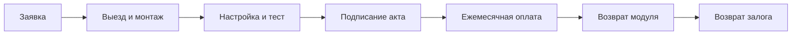

_Купить модуль NB-IoT за 260–432 BYN, SIM-карту, лицензию, оплатить монтаж — и выложить 500+ BYN сразу. Для многих это барьер. Особенно если объект сезонный, помещение арендованное, или вы просто хотите попробовать, «взлетит» ли NB-IoT в вашем подвале. Появился третий путь: аренда модуля._

## Что такое аренда модуля NB-IoT

Вы получаете полностью настроенный и смонтированный модуль дистанционного съёма. Оборудование остаётся у нас в собственности, вы платите фиксированную сумму в месяц — и пользуетесь. Когда модуль больше не нужен — сдаёте обратно и перестаёте платить.

**Стоимость: 40 BYN/мес для юрлиц, 45 BYN/мес для физлиц. Залог — 100 BYN.**

## Что входит в арендную плату

В отличие от покупки, где каждая позиция оплачивается отдельно, в аренде всё собрано в один ежемесячный платёж:

| Компонент | Что это | При покупке (разово) |
|:----------|:--------|---------------------:|
| NB-IoT модуль | Готовый к работе радиомодем с выносной антенной | 260 BYN |
| Батарейка Li-SOCl2 | Элемент питания на 5 лет автономной работы | Входит в модуль |
| IoT SIM-карта МТС | Специальный тариф NB-IoT, ~1,5 BYN/мес трафика | 21 BYN/год |
| Лицензия «Мой Клиент: Ресурсы» | Доступ к облачной платформе учёта | 44 BYN/год |
| Выезд и монтаж | Специалист приезжает, крепит, подключает к счётчику | 280 BYN |
| Настройка и тестирование | Активация SIM, привязка к платформе, проверка связи | Входит в монтаж |
| Акт ввода СДСП | Документ для инспектора Минскводоканала | Входит в монтаж |
| **Итого при покупке** | | **~498 BYN** |
| **Аренда (первый месяц)** | Залог 100 + первый месяц 40 | **140 BYN** |

> [!IMPORTANT]
> Главное отличие от покупки: вы платите **140 BYN в первый месяц** вместо 498 BYN сразу. А если через три месяца модуль больше не нужен — сдаёте, забираете залог обратно, и больше никаких платежей.

## Сколько это стоит в реальных сценариях

### Сценарий 1: Дача, 4 месяца в году

Вы живёте на даче с мая по август. Покупать модуль за 500 BYN на четыре месяца — странно. Аренда: платите 100 BYN залога и 45 × 4 = 180 BYN за сезон. В сентябре сдаёте модуль и забираете залог. **Итог: 180 BYN за сезон** против 498 BYN при покупке.

### Сценарий 2: Предписание, нужно сдать и забыть

Получили предписание Минскводоканала. Нужно установить дистанционный съём, пройти приёмку и закрыть вопрос. Покупать оборудование навсегда — дорого. Аренда: 140 BYN первый месяц, проходите приёмку, через 2–3 месяца сдаёте модуль. **Итог: 220–260 BYN** за решение вопроса под ключ.

### Сценарий 3: Арендованное помещение

Снимаете офис или склад. Водоканал требует дистанционный учёт. Покупать оборудование в чужое помещение нет смысла — при переезде придётся демонтировать и продавать. Аренда: платите 40 BYN/мес, при переезде сдаёте модуль и забираете залог. **Итог: платите только за месяцы использования.**

### Сценарий 4: Пробный запуск

Хотите проверить, работает ли NB-IoT в вашем подвале, прежде чем покупать модуль навсегда. Аренда: платите 140 BYN, получаете смонтированный работающий модуль. Через месяц-два понимаете, стоит ли покупать. **Итог: 140 BYN за «тест-драйв»** вместо 498 BYN за кота в мешке.

## Сравнение: покупка против аренды

| Критерий | Покупка под ключ | Аренда |
|:---------|:----------------:|:------:|
| **Первый платёж** | 498 BYN | 140 BYN (залог + месяц) |
| **Ежемесячный платёж** | 0 BYN | 40–45 BYN |
| **Оборудование — ваше** | Да | Нет |
| **Обслуживание и ремонт** | За свой счёт | Наша забота |
| **Можно вернуть и не платить** | Нет | Да, в любой момент |
| **Точка окупаемости покупки** | Сразу | ~12 месяцев |
| **Замена батарейки** | Сами (~25 BYN) | Бесплатно |
| **Поломка не по вашей вине** | Покупаете новый | Меняем бесплатно |

## Когда выгоднее купить, а когда — арендовать

**Покупайте модуль, если:**
- Планируете пользоваться больше года
- Объект в вашей собственности
- Не хотите зависеть от ежемесячных платежей

**Арендуйте модуль, если:**
- Нужно выполнить предписание и закрыть вопрос
- Объект сезонный (дача, летний павильон)
- Помещение арендованное
- Хотите протестировать технологию перед покупкой
- Просто нужен дистанционный съём, а покупать дорого

## Как это работает: от заявки до возврата

1. **Оставляете заявку** — по телефону или в Telegram.
2. **Инженер выезжает на объект** — в Минске на следующий день.
3. **Монтаж и подключение** — модуль крепится, подключается к импульсным выходам счётчиков, выносится антенна.
4. **Настройка** — активируется SIM-карта, модуль регистрируется в «Мой Клиент: Ресурсы», запускается тестовая передача пакета.
5. **Документы** — подписываете договор аренды и получаете акт ввода СДСП для Минскводоканала.
6. **Ежемесячная оплата** — 40 BYN (юрлица) или 45 BYN (физлица).
7. **Возврат** — привезли модуль обратно, подписали акт возврата, получили залог 100 BYN. Всё.

> [!TIP]
> **Никаких скрытых платежей.** Нет минимального срока аренды, нет штрафов за досрочный возврат, нет платы за обслуживание. Платите только аренду — и пользуетесь.

---

_Не готовы платить 500 BYN сразу? Арендуйте модуль NB-IoT за 40 BYN в месяц. Выполните предписание, сдайте узел учёта инспектору — и решайте, оставить модуль или вернуть. Звоните: [+375 29 8-462-462](tel:+375298462462), пишите в [Telegram](https://t.me/teleofis24). Выезд по Минску — на следующий день._
