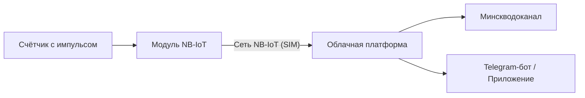

Когда собственник квартиры, частного дома или представитель организации (ТС, ЖСПК, коммерческий объект) сталкивается с необходимостью передавать показания счётчиков воды в УП «Минскводоканал» автоматически, сразу возникает несколько вопросов: **что именно покупать, сколько это стоит и где можно разумно сэкономить, не потеряв в надёжности?**

На рынке существует множество предложений — от покупки «голого» радиомодема до комплексных решений с монтажом и пятилетним обслуживанием. В этой статье мы подробно разберём все варианты, приведём прозрачные расчёты и расскажем, как избежать переплат.

---

## 1. Из чего состоит система и за что вы платите

Для автоматической передачи показаний в Водоканал недостаточно просто купить радиомодуль. Система состоит из 4 обязательных звеньев:

1. **Счётчик воды с импульсным выходом (герконом):** формирует импульсы при прохождении воды.
2. **Радиомодем NB-IoT (счётчик импульсов):** подсчитывает импульсы, хранит архив и раз в сутки передаёт пакет данных по радиоканалу сотовой связи.
3. **SIM-карта с выделенным тарифом NB-IoT:** обеспечивает энергоэффективный канал связи.
4. **Облачная платформа учёта:** принимает данные, формирует отчёты и автоматически передаёт показания на серверы УП «Минскводоканал».

---

## 2. Обзор вариантов: сколько стоит оборудование и готовые решения

Цены и состав комплекта зависят от категории потребителя и количества приборов учёта на объекте.

### Вариант А. «Только модуль» — для организаций и самостоятельной настройки
* **Кому подходит:** строительным организациям, системным интеграторам и опытным инженерам, у которых есть свои SIM-карты, сервера и программные платформы.
* **Оборудование:**
  - [**Радиомодем Nero 2576 NB-IoT**](/store/radiomodem-2576-ver-2/) — **483 BYN** (встроенная антенна, 2 импульсных входа, автономность 5–6 лет, в стоимость включено подключение к платформе учёта и личному кабинету Водоканала на 5 лет).
  - [**TELEOFIS RTU102 NB-IoT**](/store/rtu102-nb-iot/) — **406 BYN** (4 импульсных входа, 2 слота SIM, внешняя антенна).
  - [**Вега NB-11**](/store/vega-nb11/) — **492 BYN** (6 цифровых входов, охрана, IP67).
* **Связь:** SIM-карта оплачивается отдельно (тариф NB-IoT — **11.52 BYN в год** или 0.96 BYN/мес).
* **Доставка:** **12 BYN** по Минску и всей Беларуси.

---

### Вариант Б. Готовое решение «Квартира и Дом» (для физлиц)
Готовый комплект «под ключ» на базе отечественного модуля **Nero 2576 NB-IoT** для 1–2 счётчиков (холодная + горячая вода).

* **Что входит:**
  - Радиомодем Nero 2576 со встроенной антенной и элементом питания 3,6 В;
  - SIM-карта МТС «IoT-сеть» с оплаченным трафиком **на 5 лет вперед**;
  - Лицензия платформы UNICBOARD с официальной передачей в Минскводоканал **на 5 лет**;
  - **Личный Telegram-бот** для контроля расхода, проверки баланса кубометров и статуса передачи;
  - Полная заводская преднастройка и конфигурирование перед выдачей.
* **Стоимость:**
  - **552.60 BYN** — без монтажа (модуль полностью настроен, вам остаётся только соединить два провода со счётчиком по понятной схеме).
  - **629.00 BYN** — «под ключ» с выездом и профессиональным подключением специалистом в Минске (+76.40 BYN за монтаж).

👉 [Перейти к готовому решению «Квартира и Дом»](/store/modul-sim-programm/)

---

### Вариант В. Готовое решение «Бизнес и Жилфонд» (для юрлиц, ТС и ЖСПК)
Промышленное решение для организаций, коммерческих помещений и товариществ собственников на базе **TELEOFIS RTU102 NB-IoT**.

* **Что входит:**
  - Модуль RTU102 на 4 импульсных канала;
  - Выносная антенна на магнитном основании (для уверенного приёма из подвалов и металлических шкафов);
  - SIM-карта МТС «IoT-сеть» на 1 год;
  - Лицензия ПО «Мой Клиент : Ресурсы» с автоматической сдачей данных в Водоканал;
  - **Web-кабинет диспетчера для ПК + мобильное приложение для Android**;
  - Полный пакет бухгалтерских документов (договор, счёт с НДС/без НДС, акт выполненных работ).
* **Стоимость:**
  - **560.00 BYN** — без монтажа.
  - **593.62 BYN** — с выездом специалиста и монтажом в Минске (+33.62 BYN).

👉 [Перейти к готовому решению «Бизнес и Жилфонд»](/store/komplekt-yurlits-rtu102/)

---

## 3. Сводная таблица сравнения

| Параметр / Решение | Только модуль Nero 2576 | Комплект «Квартира и Дом» | Комплект «Бизнес и Жилфонд» |
| :--- | :--- | :--- | :--- |
| **Целевая аудитория** | Монтажники / Интеграторы | Физлица (квартиры, коттеджи) | Юрлица, ТС, ЖСПК, предприятия |
| **Количество счётчиков** | До 2 шт. | До 2 шт. (ХВС + ГВС) | **До 4 шт.** на один модуль |
| **SIM-карта в комплекте** | Нет (11.52 BYN/год) | **Да (на 5 лет включена)** | **Да (на 1 год включена)** |
| **Платформа учёта** | 5 лет включено | **5 лет (UNICBOARD)** | **1 год (Мой Клиент : Ресурсы)** |
| **Удобство контроля** | Web-интерфейс | **Telegram-бот в смартфоне** | **Web-портал + Android-приложение** |
| **Цена без монтажа** | **483.00 BYN** | **552.60 BYN** | **560.00 BYN** |
| **Цена с монтажом в Минске** | — | **629.00 BYN** | **593.62 BYN** |

---

## 4. Как реально сэкономить: 4 практических совета

### 1. Выбирайте решение «без монтажа», если умеете зачистить два проводка
Если у вас уже установлены счётчики с импульсным выходом (из них выходит провод), самостоятельное подключение модуля занимает 10–15 минут:
- Все наши модули передаются **уже преднастроенными и прописанными на сервере**.
- Вам остаётся только завести провод в гермоввод и зажать контакты в клеммник согласно цветной инструкции.
- **Экономия:** от **33.62 до 76.40 BYN** на монтажных работах.

### 2. Подключайте несколько счётчиков на один прибор
- В квартирах и домах модуль Nero 2576 одновременно обслуживает **2 счётчика** (холодную и горячую воду). Покупать второй модем не требуется.
- Для юрлиц и ТС модуль TELEOFIS RTU102 поддерживает **до 4 счётчиков**. Если на объекте рядом расположены 2–4 узла учёта, объедините их на один прибор.
- **Экономия:** в 2–4 раза на стоимости оборудования и ежегодной абонентской плате за SIM-карты.

### 3. Обращайте внимание на срок действия тарифа и платформы
При покупке комплекта для физлиц за **552.60 BYN** вы получаете связь и платформу **сразу на 5 лет**. 
Если покупать связь помесячно или по отдельным коммерческим тарифам, за 5 лет набегает существенная сумма. Комплектное решение фиксирует расходы на 5 лет вперёд без абонентской платы.

### 4. Проверьте счётчики воды заранее
Перед заказом убедитесь, что ваши водомеры имеют импульсный выход. Если на счётчиках нет проводов, их потребуется заменить. Покупка готового счётчика с импульсным выходом обойдётся от 70 BYN, что избавит от необходимости переделывать узел учёта в будущем.

---

## Вывод и рекомендации

1. **Если вы частное лицо (квартира / дом):** выбирайте готовое решение [«Дистанционный учёт воды: Квартира и Дом» за 552.60 BYN](/store/modul-sim-programm/) (или за **629 BYN** с выездом мастера). Вы получаете официальную передачу данных в Минскводоканал на 5 лет и удобный Telegram-бот без скрытых платежей.
2. **Если вы юрлицо или председатель ТС:** выбирайте [«Дистанционный учёт воды: Бизнес и Жилфонд» на базе RTU102 за 560.00 BYN](/store/komplekt-yurlits-rtu102/) (или **593.62 BYN** с монтажом и полным пакетом закрывающих документов).
3. **Если вы монтажная организация:** заказывайте отдельные [радиомодемы Nero 2576 за 483 BYN](/store/radiomodem-2576-ver-2/) с быстрой доставкой по всей Беларуси за 12 руб.
