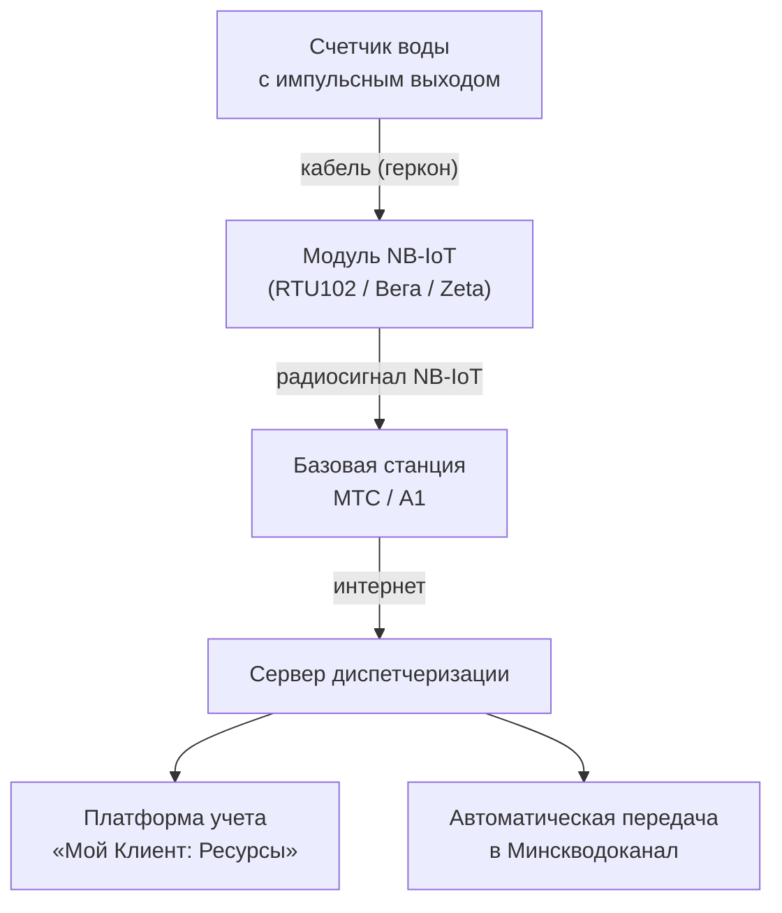
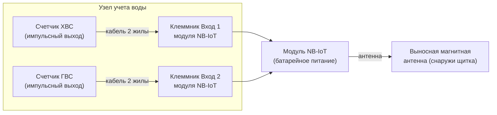

**Модуль NB-IoT для счетчика воды** — это радиомодем, который подключается к водомеру с импульсным выходом и автоматически передает показания через специализированную сеть NB-IoT (Narrowband IoT) на сервер диспетчеризации. Такое решение полностью освобождает от ручного сбора данных с циферблата и удовлетворяет требованиям УП «Минскводоканал» о дистанционном съеме показаний.

В этой статье разберем, какой модуль NB-IoT выбрать для вашего счетчика воды, как его правильно подключить и настроить, а также где купить сертифицированное оборудование в Минске.

---

## Что такое NB-IoT и почему это лучший выбор для счетчиков воды

NB-IoT (Narrowband Internet of Things) — это стандарт сотовой связи, специально разработанный для устройств телеметрии. В отличие от обычного GSM/GPRS-модуля, NB-IoT обеспечивает:

- **Повышенную проникающую способность сигнала** — уверенная связь в подвалах, сантехнических нишах и металлических щитках, где обычный телефон «не ловит».
- **Сверхнизкое энергопотребление** — модуль работает от батареи до 10 лет без замены.
- **Работу с сетями МТС и А1** — оба белорусских оператора поддерживают NB-IoT на всей территории Минска и областных центров.
- **Защищенную передачу данных** — протоколы TCP, UDP, MQTT с шифрованием.

---

## Какой модуль NB-IoT для счетчика воды выбрать

На рынке Беларуси доступны три основных модели. Выбор зависит от количества подключаемых счетчиков, условий установки и требований к надежности.

### Сравнительная таблица модулей NB-IoT

| Параметр | TELEOFIS RTU102 | Вега NB-11 | Zeta NB (Тахат) |
| :------- | :-------------: | :--------: | :-------------: |
| **Импульсных входов** | 4 | 2 | 2 или 4 |
| **SIM-слотов** | **2** (резервирование) | 1 | 1 |
| **Антенна** | Выносная магнитная (в компл.) | Встроенная | Встроенная |
| **Автономность** | **до 10 лет** | до 7 лет | до 5–6 лет |
| **Защита корпуса** | IP65 (IP68 опция) | IP67 | IP65 |
| **Сертификат СИ РБ** | № 87749-22 | Да | Да |
| **Цена** | **от {{price:rtu102-nb-iot}} BYN** | от {{price:vega-nb11}} BYN | от ~280 BYN |

### TELEOFIS RTU102 — оптимальный модуль NB-IoT для счетчика воды

Наш выбор для коммерческого учета в ТС, ЖСПК и на предприятиях. Ключевые преимущества:

- **Резервирование каналов связи (2 SIM)** — одна SIM-карта МТС, вторая А1. Если один оператор «упал», модуль автоматически переключается на второго. Это критически важно для объектов, где простой передачи данных приводит к штрафам.
- **4 универсальных входа** — подключите холодную и горячую воду с двух узлов учета к одному модулю. Экономия: не нужно покупать отдельный модем на каждый счетчик.
- **Выносная антенна на магните** — закрепите её на любой металлической поверхности (щиток, труба) и обеспечьте уверенный сигнал даже из глубокого подвала.
- **Батарея 8500 мАч на 10 лет** — установил и забыл. Не нужно раз в 3–4 года вызывать мастера для замены элемента питания.
- **MQTT, TCP, UDP** — поддержка современных протоколов для интеграции в любую SCADA или облачную платформу.

### Вега NB-11 — бюджетный модуль для 1–2 счетчиков

Подходит для небольших объектов, где достаточно одного оператора связи и до двух водомеров. Меньше функционала, но и цена ниже.

### Zeta NB (Тахат) — для новостроек

Часто закладывается в проектную документацию новых жилых домов. Если ваш дом уже спроектирован под Zeta, рекомендуем придерживаться проекта. Для модернизации существующих узлов учета лучше рассмотреть RTU102.

---

## Как подключить модуль NB-IoT к счетчику воды

Подключение модуля NB-IoT к водомеру выполняется по простой схеме и не требует прокладки силового кабеля 220 В.

### Что потребуется:

1. **Счетчик воды с импульсным выходом** — из корпуса выходит сигнальный двухжильный кабель (обычно красный и черный провод).
2. **Модуль NB-IoT** — TELEOFIS RTU102, Вега или Zeta.
3. **Отвертка** для подключения проводов в клеммную колодку модуля.

### Схема подключения:

### Порядок монтажа:

1. **Разместите модуль** на DIN-рейке или закрепите на стене вблизи счетчиков.
2. **Подключите импульсный кабель** счетчика к клеммам «Вход 1» модуля. Полярность значения не имеет (геркон — это сухой контакт).
3. **Выведите антенну** за пределы металлического щитка. Магнитное основание позволяет закрепить её на любой стальной поверхности.
4. **Вставьте SIM-карту** (МТС или А1 с поддержкой NB-IoT). В RTU102 можно вставить две SIM-карты.
5. **Настройте параметры** через RS-232 (ПО «Конфигуратор TELEOFIS»): укажите вес импульса (10 л/имп — стандарт), периодичность отправки, адрес сервера диспетчеризации.
6. **Проверьте передачу** — откройте кран, пролейте 10–20 литров воды и убедитесь, что показания в личном кабинете обновились.

> [!IMPORTANT]
> Если у вас нет навыков работы с радиооборудованием, закажите [установку и настройку модуля NB-IoT «под ключ»](/store/ustanovka-i-nastrojka-nb-iot-modulya/). Мастер приедет, подключит, настроит и выдаст акт ввода СДСП — от **{{price:modul-sim-programm}} BYN**.

---

## Настройка передачи данных

После физического подключения модуль NB-IoT необходимо запрограммировать:

### Базовые параметры настройки:

| Параметр | Типовое значение | Описание |
| :------- | :--------------: | :------- |
| Вес импульса | 10 л/имп | Соответствует паспорту счетчика |
| Период отправки | 24 часа | Ежесуточно в заданное время |
| Сервер | IP и порт облачной платформы | Например, «Мой Клиент: Ресурсы» |
| Протокол | TCP / UDP / MQTT | В зависимости от платформы |
| Тип охраны | Контроль вскрытия корпуса | При попытке несанкционированного доступа — отправка тревоги |

Стандартный сценарий: модуль каждую минуту подсчитывает импульсы от счетчика, накапливает значение в энергонезависимой памяти и раз в сутки (например, в 00:00) отправляет пакет с накопленными показаниями, напряжением батареи и статусом устройства.

---

## Где купить модуль NB-IoT для счетчика воды

Приобрести модуль NB-IoT можно в нашем интернет-магазине. Мы предлагаем несколько вариантов комплектации под разные задачи:

### Варианты покупки:

| Комплектация | Состав | Цена |
| :----------- | :----- | :--: |
| **Только оборудование** | Модуль TELEOFIS RTU102 без SIM и настройки | **{{price:rtu102-nb-iot}} BYN** |
| **Готовое решение** | Модуль + SIM МТС + программа «Мой Клиент: Ресурсы» | **{{price:modul-sim-programm}} BYN** |
| **Комплект с заменой счетчиков** | Модуль + SIM + лицензия + 2 счетчика 15 мм | **{{price:komplekt-nbiot-2-schetchika-vody-15-mm}} BYN** |
| **Установка «под ключ»** | Выезд мастера, монтаж, настройка, акты | **{{price:ustanovka-i-nastrojka-nb-iot-modulya}} BYN** |

### Почему покупают у нас:

- Оборудование **на складе в Минске** — доставка день в день.
- Все модули внесены в **Госреестр средств измерений РБ**.
- **Официальная гарантия** 1 год.
- **Бесплатная техническая консультация** перед покупкой.
- Работаем с юрлицами (безналичный расчет с НДС) и физическими лицами (ЕРИП).

> [!TIP]
> **Нужен модуль NB-IoT для счетчика воды, но не знаете с чего начать?**
> Напишите нам в Telegram **[@teleofis24](https://t.me/teleofis24)** или позвоните **[+375 (29) 8-462-462](tel:+375298462462)**. Ответим на все вопросы и поможем с выбором!

---

## Совместимость с различными типами счетчиков

Модуль NB-IoT совместим со всеми приборами учета, имеющими импульсный выход. Рассмотрим популярные типы:

### Крыльчатые счетчики (Ду 15–20 мм)

Самый распространенный тип для квартир и офисов. Имеют встроенный герконовый датчик с весом импульса 10 литров.

**Совместимые бренды:** Zenner, Sensus, Белценнер, Декаст ВСКМ, Itron, Maddalena.

### Турбинные счетчики (Ду 40–150 мм)

Промышленные водомеры для вводов в здания. Часто требуют установки дополнительного датчика импульсов.

**Совместимые бренды:** WPH-N (Вольтман) — [требуется датчик импульсов](/store/datchik-impulsov-dlya-schetchika-voltmana-tipa-w/).

### Теплосчетчики

Модуль NB-IoT может обслуживать не только воду, но и теплосчетчики с импульсным выходом. Например, подключение к тепловычислителю ТЭМ-104 или Multical.

---

## Часто задаваемые вопросы

### Можно ли подключить модуль NB-IoT к обычному счетчику без импульсного выхода?

Нет. Модуль NB-IoT считывает электрические импульсы, которые формирует герконовый или оптический датчик. Обычный механический счетчик без датчика не может быть подключен. Решение: заменить счетчик на модель с импульсным выходом или [установить накладной датчик импульсов](/store/usluga-osnashchenie-schetchika-wph-impulsnym-vyhodom/).

### Сколько счетчиков воды можно подключить к одному модулю NB-IoT?

Зависит от модели:
- **TELEOFIS RTU102** — до 4 счетчиков (импульсные входы универсальные, можно комбинировать воду и тепло).
- **Вега NB-11** — до 2 счетчиков.
- **Zeta NB** — 2 или 4 в зависимости от версии.

### Что делать, если в подвале нет сигнала сотовой связи?

Выбирайте модуль с выносной антенной (TELEOFIS RTU102). Антенну на магните можно вывести из подвала через вентиляционное окно или приямок наружу. В самых сложных случаях устанавливается выносная антенна с кабелем до 10 метров.

### Нужно ли получать отдельное разрешение Водоканала на установку модуля NB-IoT?

Нет. Установка модуля NB-IoT не требует согласования, если прибор учета уже принят на коммерческий учет. Однако после монтажа необходимо вызвать инспектора для внесения отметки о наличии СДСП в паспорт узла учета.

### Передает ли модуль данные напрямую в Минскводоканал?

Большинство модулей передают данные на облачную платформу диспетчеризации (например, «Мой Клиент: Ресурсы»), которая, в свою очередь, интегрирована с системами Минскводоканала через API. Прямая передача в Водоканал возможна по отдельному соглашению.

---

## Читайте также

- [Сравнение NB-IoT модулей для счетчиков воды в Беларуси](/blog/sravnenie-nb-iot-moduley-dlya-vody-belarus/)
- [Счетчики воды с импульсным выходом: выбор и монтаж](/blog/schetchiki-vody-s-impulsnym-vyhodom/)
- [Как сдать узел учета воды Минскводоканалу](/blog/kak-sdat-uzel-ucheta-vody-minskvodokanal/)
- [Отправка телеметрии по MQTT: настройка NB-IoT устройств](/blog/otpravka-telemetrii-po-mqtt/)
- [Дистанционный съем показаний счетчиков воды: полное руководство](/blog/distantsionny-syem-pokazaniy-schetchikov-vody-rukovodstvo/)
