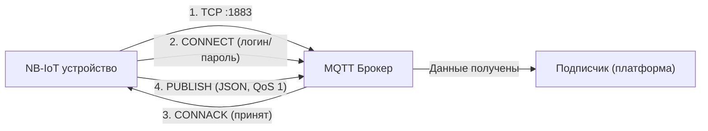

_Каждые 15 минут где-то в подвале многоквартирного дома просыпается небольшой прибор, замеряет показания счётчиков воды и отправляет JSON-пакет на сервер. Никакого HTTP, никакого опроса устройства — данные сами приходят в диспетчерскую за доли секунды. Разбираемся, как это работает на уровне протокола._

## MQTT в двух словах

MQTT — лёгкий протокол обмена сообщениями, построенный на модели **издатель–подписчик**. В центре находится **брокер** — сервер, который принимает сообщения от издателей и пересылает их подписчикам. Никаких прямых соединений между устройствами — только через брокер.

```
Издатель ──(публикация)──▶  Брокер  ──(доставка)──▶  Подписчик
                           (MQTT)
```

Каждое сообщение публикуется в **топик** — строковый идентификатор в виде пути: `sensors/temperature`, `devices/events`, `nbiot/telemetry`.

## Кто есть кто в этой схеме

- **Брокер** — сервер. Получает сообщения, хранит (при необходимости), пересылает подписчикам. В production обычно Mosquitto, VerneMQ или EMQX.
- **Издатель** — IoT-устройство. Это может быть [NB-IoT радиомодем](/store/rtu102-nb-iot/), ESP32 или Raspberry Pi. Отправляет телеметрию раз в заданный интервал.
- **Подписчик** — backend-сервис, база данных или дашборд диспетчеризации. Читает топик и обрабатывает входящие данные в реальном времени.

> [!TIP]
> Именно так работает связка «[модуль NB-IoT](/store/rtu102-nb-iot/) → брокер → платформа диспетчеризации». Устройство публикует показания, а платформа мгновенно их получает — без опроса, без задержек.

## Три шага до первого сообщения

### 1. TCP-соединение

MQTT работает поверх TCP. Первым делом устройство устанавливает сокет до брокера по стандартному порту:

```python
socket.create_connection(("broker.example.com", 1883), timeout=5)
```

Без этого шага дальше идти некуда. Если порт 1883 закрыт файерволом, используют 8883 — тот же MQTT, но поверх TLS (шифрование).

### 2. MQTT CONNECT — аутентификация

После TCP-рукопожатия клиент отправляет пакет CONNECT — представляется и передаёт учётные данные:

```python
client = mqtt.Client(client_id="my_device_001")
client.username_pw_set("username", "password")
client.connect("broker.example.com", 1883)
```

Брокер отвечает пакетом **CONNACK** с кодом возврата. Самые частые варианты:

| Код | Значение |
|:----|:---------|
| `0x00` | Принят — соединение установлено |
| `0x04` | Неверный логин или пароль |
| `0x05` | Не авторизован |

`client_id` должен быть уникальным для каждого устройства. Если два устройства подключатся с одинаковым `client_id`, брокер разорвёт первое соединение.

### 3. PUBLISH — отправка данных

После успешного подключения издатель публикует сообщение в нужный топик:

```python
payload = json.dumps({"temp": 23.5, "bat": 87})
client.publish("nbiot", payload, qos=1)
```

Параметр **QoS** (Quality of Service) определяет гарантию доставки:

| QoS | Название | Как работает |
|:----|:---------|:-------------|
| **0** | Не более одного раза | Отправил и забыл. Без подтверждения. Самый быстрый, но пакет может потеряться. |
| **1** | Минимум один раз | С подтверждением (PUBACK). Брокер гарантированно получит, но возможен дубликат. |
| **2** | Ровно один раз | Четырёхэтапное рукопожатие. Максимальная надёжность, но медленнее. |

Для телеметрии со счётчиков обычно используют **QoS 1** — золотая середина между скоростью и надёжностью.

## Формат пакета: что именно улетает в брокер

Реальный JSON-пакет от NB-IoT устройства выглядит так:

```json
{
  "Message": {
    "dev": "NB-11r3 v2.2",
    "IMEI": "XXXXXXXXXXXXXXX",
    "num": 1,
    "UTC": 1689860960
  },
  "CellStatus": {
    "EARFCN": 3548,
    "PCID": 471,
    "RSRP": -699,
    "RSRQ": -108,
    "SNR": 253
  },
  "Telemetry": {
    "reason": "time",
    "bat": 99,
    "temp": 27.1,
    "pulse1": {"C": 7015, "H": 0, "L": 0},
    "pulse2": {"C": 0, "H": 0, "L": 0},
    "states": {"I1": 1, "I2": 1, "M": 0}
  }
}
```

Три ключевых блока данных:

| Блок | Что содержит |
|:-----|:-------------|
| **Message** | Идентификация устройства: модель, IMEI, порядковый номер пакета, UNIX-время отправки |
| **CellStatus** | Параметры сотовой сети: уровень сигнала (RSRP), качество (RSRQ), идентификатор соты (PCID, EARFCN) |
| **Telemetry** | Полезные данные: заряд батареи, температура, показания импульсных входов и состояние дискретных входов/выходов |

**Pulse** (импульсный счётчик) имеет структуру `{"C": N, "H": 0, "L": 0}` — накопительный счётчик (C) и дополнительные значения для расхода по направлениям (H — верхний, L — нижний). Например, один такой вход подключается к [счётчику воды с импульсным выходом](/store/schetchik-vody-20mm-s-impulsnym-vyhodom/) и накапливает количество литров по каждому импульсу.

Блок **CellStatus** особенно полезен при диагностике: если устройство перестало выходить на связь, по RSRP и SNR сразу видно — проблема в сигнале или в самом приборе.

## Что видит подписчик

После успешной публикации любой подписчик на топике `nbiot` получает тот же JSON. Именно так backend платформы диспетчеризации получает телеметрию в реальном времени — без HTTP-запросов, без polling, чисто через подписку на топик.

```javascript
// Пример: подписчик на Node.js
client.on("message", (topic, message) => {
  const data = JSON.parse(message.toString());
  saveToDatabase(data);
});
client.subscribe("nbiot", { qos: 1 });
```

## Нюансы, о которых молчат в документации

### MQTT-брокер в Kubernetes и NodePort

Когда MQTT-брокер развёрнут в Kubernetes, порт наружу пробрасывается через Service типа **NodePort** или LoadBalancer. NodePort использует порты из диапазона **30000–32767** на каждой ноде кластера, мапя их на внутренний порт брокера:

```
Клиент → IP_ноды:30090 → Service → Pod(Mosquitto:1883)
```

На что обратить внимание:
- Убедитесь, что выбранный NodePort не занят другими сервисами и открыт на фаерволах нод.
- При использовании TLS (порт 8883) потребуется отдельный NodePort и корректно настроенный Ingress с поддержкой не-HTTP трафика.

### UDP как альтернатива MQTT

Некоторые системы (например, платформа [Мой Клиент Ресурсы](/store/licenziya-moy-klient-resursy-1-nbiot-1-year/)) поддерживают приём JSON напрямую через UDP. Схема проще: устройство отправляет строку в указанный порт — без MQTT-рукопожатий и подтверждений.

Когда UDP оправдан:
- Однонаправленный поток данных, где потеря одного пакета не критична.
- Устройства с жёстким лимитом батареи — меньше накладных расходов протокола.

Когда UDP не подходит:
- Коммерческий учёт, где важна каждая цифра.
- Сценарии, где нужен QoS и гарантированная доставка.

### Keep-Alive и Will Message

Два параметра, которые стоит настраивать всегда:

- **Keep-Alive** (в секундах) — интервал, с которым клиент отправляет PINGREQ. Если брокер не получает пакет за 1,5 × keep-alive, соединение разрывается. Для батарейных устройств ставят 300–600 секунд.
- **Will Message** (завещание) — сообщение, которое брокер опубликует, если клиент отключится аварийно. Полезно для мониторинга: топик `devices/status` с payload `{"device_id": "...", "status": "offline"}`.

## Итог: схема передачи данных за 4 шага



1. Устройство открывает TCP-соединение до брокера
2. Отправляет MQTT CONNECT с `client_id`, логином и паролем
3. Брокер подтверждает — CONNACK с кодом `0x00`
4. Устройство публикует JSON-пакет с телеметрией в топик
5. Подписчики получают данные мгновенно — без polling, без задержек

Минимум кода, максимум надёжности. Именно поэтому MQTT стал стандартом де-факто для промышленной телеметрии.

---

_Внедряете дистанционный съём показаний? Подберём NB-IoT оборудование под вашу задачу. Звоните: [+375 29 8-462-462](tel:+375298462462), пишите в [Telegram](https://t.me/teleofis24). Работаем по всей Беларуси._
