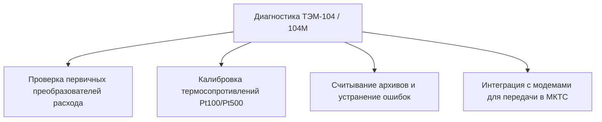
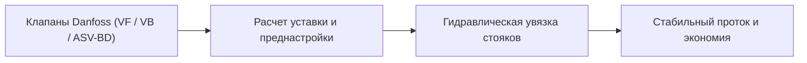

Качественная подготовка индивидуального теплового пункта (ИТП) к отопительному сезону и его безаварийный запуск — залог комфортной температуры в зданиях и отсутствия штрафных санкций со стороны филиала **«Минские тепловые сети» РУП «Минскэнерго»** и **ГП «Минсккоммунтеплосеть» (МКТС)**.

Мы предлагаем полный комплекс инженерных услуг в Минске и Минской области: **проверка, диагностика и ПНР теплосчетчиков ТЭМ-104 / ТЭМ-104М**, профессиональная **наладка электронных регуляторов температуры (Вогез, Струмень, Теплосила)**, **регулировка регулирующих клапанов Danfoss**, расчет температурного графика и практическая помощь в **запуске системы отопления**.

---

## 1. Проверка, диагностика и ПНР теплосчетчиков ТЭМ-104 и ТЭМ-104М

Теплосчетчики серии **ТЭМ-104** и **ТЭМ-104М** — одни из самых распространенных приборов коммерческого учета тепла на объектах ЖКХ, в товариществах собственников (ТС) и на промышленных предприятиях Беларуси.

### Что входит в комплекс работ по ТЭМ-104 / ТЭМ-104М:
* **Диагностика измерительных каналов:** проверка целостности сигнальных линий электромагнитных расходомеров (ПРЭ) и термопреобразователей сопротивления (комплектов термометров Pt100, Pt500).
* **Считывание и анализ архивов:** выявление нештатных ситуаций (НС), таких как разбаланс расходов в подаче и обратке ($\Delta V$), отсутствие теплоносителя, обрыв термодатчиков или завоздушивание системы.
* **Пусконаладочные работы (ПНР):** параметрирование вычислителя под конкретную схему теплопотребления (отопление, ГВС, вентиляция, подпитка), проверка веса импульса и коэффициентов.
* **Подготовка к сдаче инспектору:** проверка соответствия метрологических пломб, распечатка суточных/почасовых ведомостей и сдача узла учета тепла инспекции Энергонадзора и Тепловых сетей.

---

## 2. Наладка электронных регуляторов температуры отопления и ГВС

Автоматическое погодное регулирование позволяет экономить от **15% до 35% тепловой энергии** за счет исключения «перетопов» в осенне-весенний период и работы по утвержденному температурному графику.

Мы выполняем профессиональную настройку и программирование следующих регуляторов:

### 🔹 Вогез-210И (VOGEZ)
* Программирование режимов отопления и горячего водоснабжения (ГВС).
* Настройка ПИД-коэффициентов (пропорциональной и интегральной составляющих) для исключения колебательного режима электропривода клапана.
* Конфигурирование графика суточного и недельного снижения температуры в нерабочие часы (для офисов и производств).

### 🔹 РТМ-03 «Струмень» (СП «Гран-Система-С»)
* Настройка работы по датчику наружного воздуха (кривая отопления) и датчику температуры теплоносителя.
* Калибровка каналов аналоговых входов и юстировка показаний термодатчиков.
* Настройка алгоритма защиты от замерзания и ограничения максимальной температуры теплоносителя в обратном трубопроводе ($T_{2}$).

### 🔹 Регуляторы температуры РТ-2012 (ОАО «Завод Этон»)
* Программирование и наладка микропроцессорных регуляторов **РТ-2012** (производства ОАО «Завод Этон», г. Новолукомль / Минск).
* Задание температурного графика, привязка к датчикам наружного воздуха и теплоносителя.
* Настройка энергосберегающих режимов, функции дежурного отопления и ограничения максимальной температуры теплоносителя.

### 🔹 Регуляторы тепловой энергии МР-01 (ООО «ТЕРМО-К»)
* Конфигурирование микропроцессорных регуляторов **МР-01** (производства ООО «ТЕРМО-К», г. Минск).
* Настройка каналов управления регулирующими клапанами (типа КС, КПСС и др.) и циркуляционными насосами.
* Почасовое и недельное программирование режимов отопления и ГВС, адаптация под реальные теплопотери здания.

### 🔹 Модули управления TTR, клапаны TRV и регуляторы RDT (ГК «Теплосила»)
* **Контроллеры TTR (TTR-01, TTR-02A, TTR-12A):** параметрирование многофункциональных модулей управления отоплением, вентиляцией и ГВС, настройка суточных/недельных погодных графиков и каскадного управления насосами.
* **Регулирующие клапаны TRV / TRV-3 с приводами TSL:** юстировка хода штока, настройка трехпозиционного или аналогового управления (0–10 В, 4–20 мА).
* **Регуляторы перепада давления прямого действия RDT (RDT, RDT-P, RDT-S, RDT-B):** гидравлическая наладка без внешнего электропитания для стабилизации перепада давления, исключения шума в радиаторах и защиты теплоузла от резких скачков давления в сети.

---

## 3. Регулировка клапанов Danfoss, балансировка ASV-BD и расчет тепловых уставок

Регулирующая и балансировочная арматура **Danfoss** — эталон надежности в современных системах отопления и ИТП, но для эффективной работы она требует точной инженерной наладки.

### 🔹 Ручные балансировочные клапаны Danfoss ASV-BD
Клапан **Danfoss ASV-BD** — это многофункциональный ручной балансировочный клапан со встроенным шаровым краном, измерительными ниппелями и механизмом фиксации настройки.

* **Назначение:** гидравлическая увязка стояков отопления, веток теплого пола и приточных вентиляционных установок, ограничение максимального расхода теплоносителя.
* **Ключевые особенности конструкции:**
  - Вращающийся на 360° блок сливного крана и измерительных ниппелей для удобного подключения дифференциального манометра в стесненных условиях ИТП.
  - Высококонтрастная шкала преднастройки с фиксацией положения (блокировка от несанкционированного изменения жильцами или обслуживающим персоналом).
  - 100% герметичное перекрытие потока (функция шарового крана).
  - Возможность прямого подключения импульсной трубки от автоматического регулятора перепада давления (ASV-PV / ASV-P).

### 🛠 Процесс регулировки и наладки Danfoss ASV-BD:
1. **Расчет расчетного расхода ($G$, м³/ч):** на основе проектных тепловых нагрузок каждого стояка или ветки.
2. **Определение позиции преднастройки:** расчет требуемой пропускной способности $K_v$ и выставление значения по шкале настройки (от 0.0 до максимального оборота) с помощью шестигранного ключа.
3. **Инструментальное измерение перепада давления ($\Delta P$):** подключение портативного ультразвукового или дифференциального расходомера/манометра к ниппелям клапана для фактической проверки расхода.
4. **Фиксация настройки:** блокировка штока для сохранения выверенного гидравлического баланса всей системы здания.

### 🔹 Седельные регулирующие клапаны Danfoss (VB2, VF2, VF3, VRB с приводами AMV, AME)
1. **Механическая ревизия и ход штока:** проверка плавности перемещения штока, калибровка концевых микропереключателей электропривода (автоматическая адаптация хода штока привода AME).
2. **Расчет тепловой уставки:**
   - Инженерный расчет необходимой тепловой мощности в зависимости от текущей температуры наружного воздуха ($T_{\text{нар}}$).
   - Расчет требуемого коэффициента пропускной способности $K_{vs}$ и параметров дросселирования.
3. **Параметрирование под тепловую нагрузку здания:**
   - Установка скоростей реакции привода для предотвращения гидравлических ударов.
   - Жесткая привязка к нормативному температурному графику теплоисточника (ТЭЦ / котельной) во избежание штрафов за превышение температуры «обратки».

---

## 4. Практическая помощь в запуске отопления и гидроиспытаниях

Запуск системы отопления — критический момент, когда необходимо быстро выявить и устранить воздушные пробки, гидравлический перекос по стоякам и сбои в автоматике.

### Наши инженеры выполняют:
* **Поэтапный запуск теплоузла:** плавное заполнение системы через обратную линию, предотвращение гидроударов.
* **Наладку циркуляционных насосов:** проверка правильности чередования фаз, настройка частотных преобразователей и балансировка рабочего давления.
* **Контроль перепада давления ($\Delta P$):** настройка регуляторов перепада давления (Danfoss AVP, Вогез АРПД, Теплосила RDT) для стабилизации гидравлического режима.
* **Устранение шума и вибраций в трубопроводах:** правильная настройка соотношения расходов и сечений регулирующей арматуры.

---

## Сводная таблица услуг и оборудования

| Направление | Обслуживаемое оборудование | Основные результаты работ |
| :--- | :--- | :--- |
| **Учет тепла (ПНР / Диагностика)** | ТЭМ-104, ТЭМ-104М, МТР-06 | Точный коммерческий учет, чистые архивы без ошибок, сдача инспекторам МКТС |
| **Погодные регуляторы и контроллеры** | Вогез-210И, РТМ-03, МР-01, РТ-2012, TTR (Теплосила) | Экономия тепла до 30%, соблюдение графика $T_1/T_2$, комфорт в помещениях |
| **Регулирующая арматура и приводы** | Клапаны Danfoss (VF, VRB, AMV/AME), Теплосила TRV/TSL | Точный ход штока, отсутствие гидравлических ударов, расчет оптимальных уставок |
| **Балансировочные клапаны** | Danfoss ASV-BD (с ниппелями и фиксацией) | Точная гидравлическая увязка стояков, устранение недогрева дальних радиаторов |
| **Регуляторы перепада давления** | Danfoss AVP, Вогез АРПД, Теплосила RDT | Стабилизация гидравлики, защита от гидроударов и шума в системе отопления |
| **Диспетчеризация узла** | Модемы iRZ, Индел, USR, RTU102 | Автоматическая выгрузка отчетов в МКТС в Excel без ручного труда |

---

## Почему председатели ТС и главные энергетики выбирают нас

1. **Глубокая инженерная квалификация:** досконально знаем алгоритмы работы белорусских приборов (ТЭМ, Вогез, Гран-Система, Теплосила) и европейской автоматики (Danfoss).
2. **Официальный допуск и сдача:** готовим полный комплект исполнительной документации для Минских тепловых сетей и Энергонадзора.
3. **Оперативный выезд по Минску и области:** при аварийных ситуациях, сбоях в работе регуляторов или отказе датчиков оперативно выезжаем на объект.
4. **Безналичный расчет:** работаем по официальным договорам со счетом и закрывающими актами выполненных работ.

---

### Нужна наладка автоматики, диагностика ТЭМ-104 или запуск отопления?

Свяжитесь с нами прямо сейчас — поможем рассчитать уставки, настроить оборудование и успешно сдать теплоузел к новому отопительному сезону!

* 📞 **Телефон для консультаций и вызова инженера:** [+375 (29) 846-24-62](tel:+375298462462)
* 💬 **Telegram:** [@teleofis_by](https://t.me/teleofis_by)
* 🏢 **Адрес в Минске:** ул. Макаёнка, 12Г
