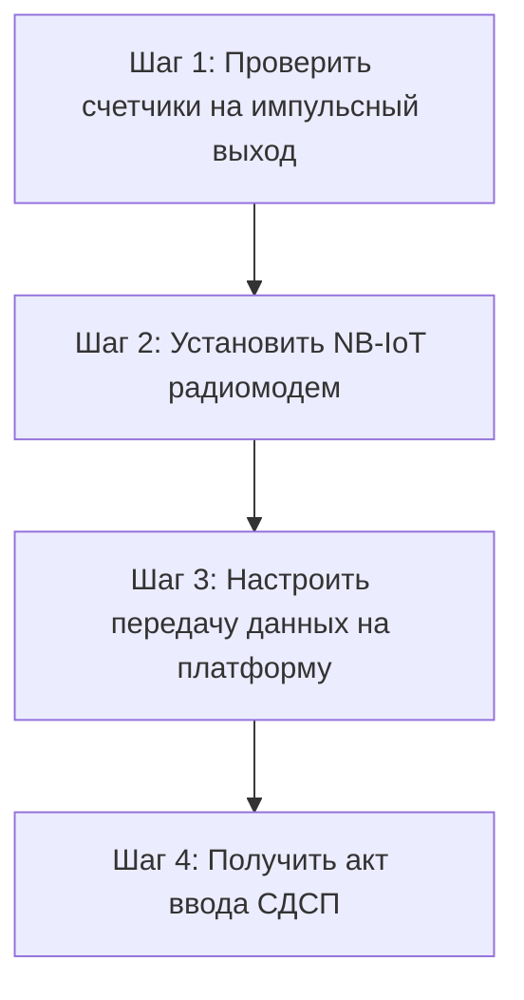

**Постановление Совета Министров Республики Беларусь № 788** внесло важные изменения в «Правила пользования централизованными системами водоснабжения, водоотведения в населенных пунктах». Главное новшество, которое напрямую коснулось товариществ собственников (ТС), ЖСПК и всех юридических лиц — это **обязательный переход на системы дистанционного съема показаний (СДСП)**.

В этой статье мы подробно разберем требования закона: кому, когда и на каких условиях необходимо устанавливать «умные» приборы учета воды, чтобы избежать крупных штрафов и расчетов по пропускной способности трубы.

---

## Что именно требует Постановление № 788?

Основная суть изменений заключается в следующем:

> Все вновь устанавливаемые приборы коммерческого учета воды, а также приборы учета, подлежащие замене или ремонту (включая плановую государственную поверку), **в обязательном порядке должны быть оснащены системами дистанционного съема показаний**.

Для юридических лиц и ТС это означает, что если ваш текущий водомер подошел к сроку государственной поверки (который обычно составляет 4–6 лет), вы не можете просто снять его, поверить и поставить обратно в прежнем виде. Прибор учета после поверки или его замена **должны быть сданы инспектору Водоканала только совместно с работающей системой дистанционной передачи данных**.

---

## Кого касаются новые требования закона?

Обязательство по внедрению систем автоматического сбора показаний распространяется на следующие категории потребителей:

1. **Товарищества собственников (ТС) и ЖСПК:** касается как общедомовых узлов учета воды (на вводах в многоквартирный дом), так и коммерческих узлов учета встроенных нежилых помещений (магазины, парикмахерские, офисы на первых этажах жилых домов).
2. **Юридические лица и ИП:** любые коммерческие и государственные объекты — от небольших офисов до крупных производственных цехов, складов, торговых центров и административных зданий.
3. **Строящиеся объекты:** новые здания просто не могут быть сданы в эксплуатацию и приняты на баланс Водоканала без смонтированной и функционирующей системы диспетчеризации АСКУЭ.

---

## Что будет, если проигнорировать требования закона?

Некоторые организации надеются обойти правила или затянуть процесс установки. Однако последствия отказа от внедрения СДСП весьма жесткие:

- **Отказ в пломбировке:** Инспектор УП «Минскводоканал» просто откажется опломбировать прибор учета после плановой замены или поверки, если к нему не подключен работающий модуль связи (например, NB-IoT).
- **Снятие с коммерческого учета:** Без пломбы узел учета считается недействительным. Расчет потребления воды будет переведен с фактических показаний на нормативные.
- **Расчет по пропускной способности:** Для юрлиц в случае отсутствия коммерческого учета расчет воды производится по максимальной пропускной способности трубы при скорости движения воды 2 м/с в течение 24 часов в сутки. Это выливается в огромные счета на тысячи рублей ежемесячно, даже если реальный расход равен нулю.

---

## Как правильно выполнить предписание Водоканала?

Чтобы ваш узел учета был принят без замечаний с первой попытки, необходимо выполнить следующие технические шаги:

1. **Оценить совместимость счетчиков:** Ваши счетчики воды должны иметь импульсный датчик (геркон) с выходящим кабелем. Если их нет, потребуется полная замена водомеров на импульсные (например, [водомер SmartFlow](/store/schetchik-vody-15-mm-s-impulsnym-vyhodom/) или Декаст).
2. **Установить передающий модуль:** Подключить счетчики к сертифицированному устройству сбора и передачи данных (УСПД). Оптимальным выбором является [NB-IoT модуль Teleofis RTU102](/store/rtu102-nb-iot/), который работает полностью автономно от батареи до 10 лет и поддерживает две SIM-карты для стабильного сигнала в глубоких подвалах.
3. **Настроить диспетчеризацию:** Подключить УСПД к лицензионной платформе учета (например, «Мой Клиент: Ресурсы»). Передача данных должна производиться стабильно согласно техническим условиям.
4. **Оформить документы:** Составить акт ввода системы дистанционного съема в эксплуатацию и вызвать инспектора Водоканала для опломбировки приборов и модуля связи.

> [!IMPORTANT]
> Наша компания «Телеофис» предоставляет комплексную услугу **[установки счетчиков с дистанционным снятием «под ключ»](/services/ustanovka-sistem-distantsionnogo-syema-pokazaniy/)** в Минске. Мы берем на себя все этапы: от подбора совместимых приборов до подготовки исполнительной документации для Минскводоканала. Гарантия успешной сдачи — 100%!

---

## Часто задаваемые вопросы

**Кто несет расходы по покупке и монтажу оборудования?**
Согласно Правилам пользования водоснабжением, все расходы на приобретение, монтаж, поверку и обслуживание приборов учета и систем дистанционного съема несет абонент (собственник здания, ТС или юридическое лицо).

**Можно ли использовать старый GSM модем?**
Нет. Старые GSM/GPRS модемы требуют постоянного питания 220 В, потребляют много энергии и больше не соответствуют современным техническим требованиям Минскводоканала к автономным системам связи. Сейчас единственным надежным стандартом является **NB-IoT** (технология Интернета вещей на частотах LTE).

**Где купить сертифицированный комплект?**
Готовые комплекты, полностью соответствующие требованиям белорусского законодательства и УП «Минскводоканал», вы можете приобрести в нашем магазине:

- [Комплект: NB-IoT модуль + 2 счетчика воды 15 мм](/store/komplekt-nbiot-2-schetchika-vody-15-mm/) — идеален для квартир, офисов и небольших коммерческих помещений.
- [Модем Teleofis RTU102 с настроенной SIM-картой](/store/rtu102-nb-iot/) — промышленное решение на 4 импульсных входа.

Обеспечьте соответствие вашего бизнеса всем требованиям законодательства РБ без лишних хлопот. Закажите установку системы удаленного учета воды уже сегодня!
