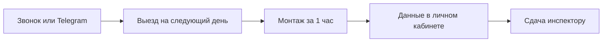

_«Почём самый дешёвый NB-IoT модуль?» — это первый вопрос, который задают девять из десяти позвонивших. И логика понятна: предписание от Минскводоканала уже висит на стене, бюджет не резиновый, а платить 400–500 BYN за оборудование прямо сейчас не хочется. Ответ вас удивит._

## Самый дешёвый модуль NB-IoT — это аренда

Не «дешёвый китайский», не «бу на Авито», не «у знакомого электрика». Самый дешёвый способ получить работающий модуль NB-IoT в Минске — **взять его в аренду за 40 BYN в месяц**. И вот почему.

### Что значит «дешёвый» на самом деле

Покупая модуль, вы платите один раз, но много и сразу. Арендуя — платите понемногу, только за те месяцы, когда пользуетесь. Ключевое слово: **пользуетесь**. Если модуль нужен на три месяца — вы платите за три месяца. А не за три года.

Давайте посчитаем:

| Способ | Ваш платёж сегодня | Ежемесячно | Оборудование ваше? |
|:-------|:-------------------:|:----------:|:------------------:|
| **Покупка модуля RTU102** | 260 BYN | 0 BYN | Да |
| **Покупка + монтаж + SIM + лицензия** | 498 BYN | 0 BYN | Да |
| **Покупка Веги NB-11 + монтаж** | 603 BYN | 0 BYN | Да |
| **Аренда (наш вариант)** | **100 BYN залога** | **40 BYN** | Нет (но это плюс) |

Залог возвращается. Значит, ваш реальный расход в первый месяц — **40 BYN**. Не 498. Не 260. Сорок.

## Почему аренда дешевле — раскладываем цену

Секрет в том, что при покупке вы финансируете:
- Производство модуля (260 BYN)
- Батарейку на 5 лет (включена в модуль)
- Выносную антенну (включена в комплект)

При аренде мы оставляем оборудование себе. Вы платите только за **доступ** к дистанционному съёму. Как с облачным сервисом: вы же не покупаете сервер в дата-центре, чтобы пользоваться почтой.

| Что вы получаете | При покупке | При аренде |
|:-----------------|:-----------:|:----------:|
| Работающий модуль NB-IoT | 260 BYN | ✓ |
| IoT SIM-карта МТС | 21 BYN | ✓ |
| Лицензия «Мой Клиент: Ресурсы» | 44 BYN | ✓ |
| Выезд инженера и монтаж | 280 BYN | ✓ |
| Настройка и тестирование | В монтаже | ✓ |
| Акт ввода СДСП | В монтаже | ✓ |
| Замена батарейки через 3–5 лет | Сами (~25 BYN) | Бесплатно |
| Поломка не по вашей вине | Новый модуль (~260 BYN) | Бесплатная замена |
| **Платёж в первый месяц** | **498 BYN** | **100 BYN (залог) + 40 BYN** |

## Для кого 40 BYN/мес реально выгоднее, чем покупка за 500

### Сезонная дача

Живёте за городом с мая по сентябрь? Пять месяцев. Аренда: 100 BYN залога + 45 × 5 = 325 BYN. Осенью сдали модуль — залог вернулся. Чистый расход: **225 BYN за сезон**. Покупка: 498 BYN. Разница — больше чем в два раза.

### Предписание «просто чтоб отстали»

Минскводоканал требует дистанционный съём. Вы не планируете пользоваться этими данными — вам нужно, чтобы инспектор принял узел учёта и поставил пломбу. Аренда: два-три месяца = 180–220 BYN. Всё. Покупка: 498 BYN навсегда.

### Арендованное помещение

Снимаете офис или склад. Через год договор аренды заканчивается. Покупать модуль в чужую недвижимость? Аренда: платите 40 BYN/мес, при переезде сдаёте обратно и забираете залог. Модуль остаётся у нас, вы остаётесь при своих.

### «А вдруг не заработает?»

Самый частый страх: купить модуль за 500 BYN, а он не «пробьёт» сигнал из глубокого подвала. Аренда снимает этот риск: 140 BYN — и через день вы уже видите данные в личном кабинете. Работает — отлично. Не работает? Мы ищем решение или забираем модуль, возвращаем залог. Вы ничем не рискуете.

## «А что, если модуль сломается?»

При покупке — покупаете новый. При аренде — звоните нам, и мы меняем модуль бесплатно. Потому что оборудование наше, и его работоспособность — наша забота, не ваша.

Исключение — механическое повреждение по вашей вине (уронили, залили, разбили). Тогда стоимость ремонта удерживается из залога. Но честно: за всю практику таких случаев — единицы.

## «А могу я потом передумать и выкупить модуль?»

Да. Если через несколько месяцев решите, что аренда вам надоела и хотите владеть модулем — вычитаем уплаченные арендные платежи из стоимости оборудования, и модуль становится вашим.

## Цифры за 3 года: аренда против покупки

Допустим, модуль нужен три года. Что выгоднее?

| Статья | Покупка | Аренда (40 BYN/мес) |
|:-------|:-------:|:--------------------:|
| Модуль + SIM + лицензия (1-й год) | 498 BYN | 140 BYN |
| SIM + лицензия (2-й год) | 65 BYN | Включено |
| SIM + лицензия (3-й год) | 65 BYN | Включено |
| Замена батарейки | 25 BYN | Бесплатно |
| **Итого за 3 года** | **653 BYN** | **140 + 480 = 620 BYN** |

За три года цифры почти сравниваются. А если модуль нужен на год или меньше — аренда выигрывает с огромным отрывом.

> [!IMPORTANT]
> Мораль: если вы точно знаете, что модуль проработает у вас больше года — покупайте. Если нет — арендуйте. Простая математика.

## Как начать за 40 BYN

1. **Свяжитесь с нами** — [+375 29 8-462-462](tel:+375298462462) или [Telegram](https://t.me/teleofis24).
2. **Инженер выезжает** — в Минске на следующий рабочий день.
3. **Монтаж** — 40–60 минут: закрепили, подключили, настроили, протестировали.
4. **Документы** — договор аренды и акт ввода СДСП у вас на руках.
5. **Платёж** — 100 BYN залога + 40 BYN за первый месяц. Дальше — 40 BYN ежемесячно.

---

_Самый дешёвый NB-IoT модуль в Минске не продаётся. Он сдаётся в аренду. 40 BYN в месяц — и дистанционный съём работает. Звоните: [+375 29 8-462-462](tel:+375298462462), пишите в [Telegram](https://t.me/teleofis24)._
