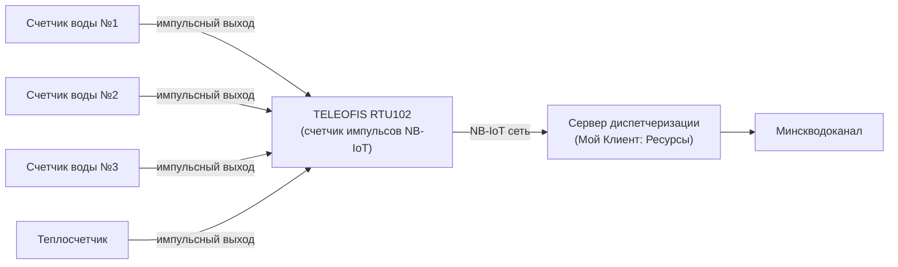

**Счетчик импульсов NB-IoT** — это специализированное устройство сбора и передачи данных (УСПД), которое подключается к водомерам с импульсным выходом и автоматически отправляет показания через сеть NB-IoT на сервер диспетчеризации. Если вы ищете, где **купить счетчик импульсов NB-IoT** в Минске, эта статья поможет разобраться в доступных моделях, их характеристиках и ценах.

В отличие от бытового счетчика воды, «счетчик импульсов» в контексте NB-IoT — это именно **радиомодуль**, выполняющий функцию подсчета импульсов от водомеров и передачи накопленных данных. Одно такое устройство способно обслуживать от 2 до 4 приборов учета одновременно.

---

## Какие счетчики импульсов NB-IoT доступны на рынке Беларуси

На белорусском рынке представлены три основных бренда NB-IoT модулей, выполняющих функцию счетчика импульсов. Рассмотрим каждый подробно.

| Модель | Импульсных входов | SIM-слотов | Автономность | Защита | Ориентировочная цена |
| :----- | :---------------: | :--------: | :----------: | :----: | :-------------------: |
| **TELEOFIS RTU102** | 4 | 2 (А1 + МТС) | до 10 лет | IP65/IP68 | от {{price:rtu102-nb-iot}} BYN |
| **Вега NB-11** | 2 | 1 | до 7 лет | IP67 | от {{price:vega-nb11}} BYN |
| **Zeta NB (Тахат)** | 2 или 4 | 1 | до 5–6 лет | IP65 | от ~280 BYN |

### TELEOFIS RTU102 — оптимальный выбор для коммерческого учета

Модуль **TELEOFIS RTU102** — это самый функциональный счетчик импульсов NB-IoT на рынке. Ключевые преимущества:

- **4 универсальных входа** — можно подключить до 4 счетчиков воды или 2 счетчика воды + 2 теплосчетчика на одно устройство.
- **2 SIM-слота с резервированием** — установите SIM-карты МТС и А1 одновременно. При сбое одного оператора устройство автоматически переключится на резервный канал.
- **Выносная магнитная антенна в комплекте** — решает проблему слабого сигнала в подвалах с толстыми железобетонными перекрытиями.
- **Литиевая батарея 8500 мАч** — до 10 лет автономной работы без замены элемента питания.
- **Сертификат № 87749-22** — внесен в Госреестр средств измерений РБ.

### Вега NB-11 — компактное решение для квартир

Российский модуль **Вега NB-11** — более бюджетный вариант с базовым функционалом. Подходит для простых объектов, где не требуется резервирование каналов связи.

- 2 импульсных входа
- Встроенная антенна
- Срок службы батареи до 7 лет
- Компактный корпус IP67

### Zeta NB (Тахат) — белорусская разработка

Модуль **Zeta NB** от отечественного производителя ООО «ТахатАкси» часто проектируется в новые жилые дома. Однако имеет ряд ограничений:

- 1 SIM-слот без резервирования
- Меньшая емкость батареи (замена через 4–5 лет)
- Внешняя SMA-антенна в комплекте

---

## Как выбрать счетчик импульсов NB-IoT: пошаговая инструкция

Чтобы купить правильный счетчик импульсов NB-IoT, ответьте на пять вопросов:

### 1. Сколько приборов учета нужно подключить?

- **1–2 счетчика** — достаточно модуля с 2 входами (Вега NB-11 или RTU102).
- **3–4 счетчика** — нужен модуль с 4 входами (TELEOFIS RTU102).

### 2. Важно ли резервирование связи?

Если объект находится в зоне неуверенного приема или простой передачи данных недопустим, выбирайте модуль с двумя SIM-слотами — это есть только у TELEOFIS RTU102.

### 3. Где будет установлен модуль?

- **Подвал, колодец, влажное помещение** — обязателен корпус IP65 и выше.
- **Глубокий подвал с плохим сигналом** — нужна выносная антенна.

### 4. Нужна ли автономная работа на 10 лет?

Если доступ к узлу учета затруднен (опломбированный подвал, колодец), выбирайте модуль с батареей повышенной емкости. Каждая замена батареи — это вызов мастера и дополнительные расходы.

### 5. Какой бюджет?

| Бюджет | Рекомендуемое решение |
| :----- | :-------------------- |
| Эконом | Вега NB-11 — от {{price:vega-nb11}} BYN |
| Оптимальный | TELEOFIS RTU102 — от {{price:rtu102-nb-iot}} BYN (лучшее соотношение цена/функции) |
| Готовый комплект | [Модуль + SIM + программа](/store/modul-sim-programm/) — от {{price:modul-sim-programm}} BYN |

---

## Где купить счетчик импульсов NB-IoT в Минске

Приобрести сертифицированные счетчики импульсов NB-IoT можно в нашем интернет-магазине. Мы предлагаем:

- **Оборудование со склада в Минске** — доставка день в день по городу.
- **Официальная гарантия производителя** — 1 год на все модули.
- **Полный пакет документов** — сертификаты, паспорта приборов, акты для Водоканала.
- **Помощь в подборе** — бесплатная консультация инженера перед покупкой.

### Актуальные модели в наличии:

- **[TELEOFIS RTU102 NB-IoT](/store/rtu102-nb-iot/)** — счетчик импульсов на 4 входа с резервированием SIM — **{{price:rtu102-nb-iot}} BYN**
- **[Модуль NB-IoT + SIM + программа](/store/modul-sim-programm/)** — готовое решение «включи и работай» — **{{price:modul-sim-programm}} BYN**
- **[Комплект NB-IoT + 2 счетчика воды 15 мм](/store/komplekt-nbiot-2-schetchika-vody-15-mm/)** — полный набор для одного узла учета

---

## Как купить счетчик импульсов NB-IoT: порядок действий

1. **Консультация.** Свяжитесь с нами по телефону или в Telegram. Опишите ваш объект: количество счетчиков, место установки, наличие импульсных выходов.
2. **Подбор оборудования.** Инженер подберет оптимальный модуль под ваши задачи и бюджет.
3. **Оплата.** Наличный и безналичный расчет (для юрлиц с НДС), оплата через ЕРИП.
4. **Доставка.** В пределах Минска — день в день или на следующий день. По Беларуси — почтой или курьерской службой.
5. **Монтаж и настройка.** При необходимости наши специалисты выполнят установку и пусконаладку «под ключ».

> [!TIP]
> **Не знаете, какой счетчик импульсов NB-IoT купить?**
> Отправьте фото вашего узла учета в Telegram **[@teleofis24](https://t.me/teleofis24)** — подберем оптимальное решение за 10 минут. Или звоните: **[+375 (29) 8-462-462](tel:+375298462462)**.

---

## Совместимость со счетчиками воды

Счетчик импульсов NB-IoT работает с любыми водомерами, имеющими импульсный выход (геркон, NAMUR, оптопара). Наиболее популярные производители совместимых приборов в Беларуси:

- **Zenner**, **Sensus**, **Белценнер** — крыльчатые счетчики с герконом
- **WPH-N (Вольтман)** — турбинные счетчики (требуется дополнительный датчик импульсов)
- **Декаст ВСКМ** — квартирные и общедомовые водомеры
- **Apator Powogaz** — промышленные счетчики

Если ваши счетчики не имеют импульсного выхода, мы предлагаем [услугу оснащения импульсным датчиком](/store/usluga-osnashchenie-schetchika-wph-impulsnym-vyhodom/) или [замену на новые импульсные водомеры](/store/schetchik-vody-15-mm-s-impulsnym-vyhodom/).

---

## Ответы на частые вопросы

### Нужно ли менять старые счетчики при установке счетчика импульсов NB-IoT?

Нет, если ваши счетчики уже имеют импульсный выход (из них выходит сигнальный кабель). Достаточно подключить этот кабель к NB-IoT модулю. Если счетчики без импульсного выхода — их необходимо заменить или дооснастить датчиками.

### Сколько счетчиков можно подключить к одному модулю NB-IoT?

Зависит от модели. TELEOFIS RTU102 поддерживает до 4 приборов учета одновременно. Вега NB-11 — до 2. Zeta NB — 2 или 4 в зависимости от модификации.

### Как часто передаются показания?

Стандартно — раз в сутки (настраивается). Возможна передача раз в час или раз в 6 часов для объектов с повышенными требованиями к контролю.

### Нужно ли питание 220 В для работы счетчика импульсов NB-IoT?

Нет. Все перечисленные модули работают автономно от встроенных литиевых батарей. Срок службы — от 5 до 10 лет без замены элемента питания.

### Принимает ли Минскводоканал данные с таких устройств?

Да. Оборудование TELEOFIS RTU102 внесено в Госреестр средств измерений РБ (№ 87749-22) и соответствует всем требованиям УП «Минскводоканал» к системам дистанционного съема показаний.

---

## Читайте также

- [Сравнение NB-IoT модулей для счетчиков воды в Беларуси](/blog/sravnenie-nb-iot-moduley-dlya-vody-belarus/)
- [Счетчики воды с импульсным выходом: выбор и монтаж](/blog/schetchiki-vody-s-impulsnym-vyhodom/)
- [Счетчик воды с дистанционным съемом показаний: цена](/blog/schetchik-vody-distancionniy-syom-cena/)
- [Как сдать узел учета воды Минскводоканалу](/blog/kak-sdat-uzel-ucheta-vody-minskvodokanal/)
- [Постановление №788: полный разбор](/blog/postanovlenie-788-distantsionny-syem-razbor/)
