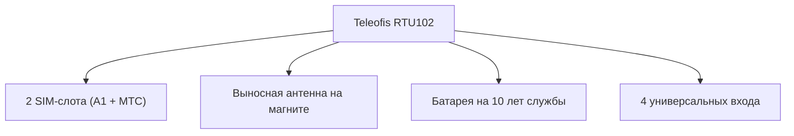

Переход на автоматизированный дистанционный учет воды в Беларуси согласно Постановлению №788 породил большой спрос на специализированное беспроводное оборудование — радиомодемы (УСПД) стандарта **NB-IoT**. На белорусском рынке представлено несколько популярных решений, но наиболее широкое распространение получили три бренда: российские приборы **TELEOFIS RTU102**, отечественные модули **Zeta NB** от предприятия «Тахат» и модемы **Вега**.

В этой статье мы проведем подробный независимый технический обзор и сравнение этих систем дистанционного съема, чтобы помочь председателям ТС, инженерам и владельцам недвижимости сделать правильный выбор под свои задачи и бюджет.

---

## Подробная таблица сравнения технических характеристик

| Характеристика / Параметр        | TELEOFIS RTU102                   | Zeta NB (Тахат)                      | Вега NB-11 / NB-15     |
| :------------------------------- | :-------------------------------- | :----------------------------------- | :--------------------- |
| **Количество импульсных входов** | **4 входа** (универсальные)       | 2 или 4 входа                        | 2 или 4 входа          |
| **SIM-слоты (резервирование)**   | **2 SIM-слота** (МТС + А1)        | 1 SIM-слот                           | 1 SIM-слот             |
| **Антенна**                      | Выносная на магните (в комплекте) | Встроенная (или выносная за доплату) | Встроенная или внешняя |
| **Автономность (срок батареи)**  | **До 10 лет** (Li-SOCl2 8500 мАч) | До 5–6 лет                           | До 5–7 лет             |
| **Защита корпуса**               | **IP65** (герметизация до IP68)   | IP65                                 | IP65 / IP67            |
| **Поддержка протоколов**         | TCP, UDP, MQTT, CoAP              | Собственный протокол                 | TCP, UDP, CoAP         |
| **Внесение в Госреестр СИ РБ**   | **Да** (Сертификат № 87749-22)    | Да                                   | Да                     |
| **Розничная цена (ориентир)**    | **~260 BYN**                      | ~280 BYN                             | ~250 BYN               |

---

## 1. TELEOFIS RTU102 NB-IoT (Наш выбор)

Радиомодем **TELEOFIS RTU102** зарекомендовал себя как наиболее надежное и функциональное решение для коммерческого учета в сложных условиях белорусских подвалов.

### Основные преимущества:

- **Резервирование связи (2 SIM-карты):** Это ключевой плюс. Вы можете установить SIM-карты сразу двух операторов (А1 и МТС). Если на объекте пропадет сеть МТС, модем автоматически переключится на А1, гарантируя бесперебойный сбор данных. У конкурентов такой возможности нет.
- **Выносная магнитная антенна в комплекте:** Модем можно смонтировать глубоко в металлическом щитке, а саму антенну вывести наружу на магните, обеспечив уверенный прием сигнала NB-IoT.
- **Высокая автономность:** Мощная литиевая батарея емкостью 8500 мАч обеспечивает до 10 лет работы при передаче показаний раз в сутки.
- **Универсальность:** 4 цифровых входа позволяют подключить к одному прибору, например, 2 счетчика воды (холодная + горячая) и 2 теплосчетчика.

### Минусы:

- Габариты чуть больше, чем у компактных Zeta.

---

## 2. Zeta NB (Производство ООО «ТахатАкси»)

Отечественный модуль **Zeta NB** — популярное белорусское решение, которое часто закладывается в проекты новых жилых домов.

### Основные преимущества:

- **Компактный размер:** Удобно монтировать в стесненных условиях квартирных сантехнических шкафов.
- **Простая интеграция:** Хорошо интегрирован с популярным ПО диспетчеризации в РБ.

### Недостатки и подводные камни:

- **Один SIM-слот:** При сбоях связи у выбранного оператора передача данных останавливается до устранения аварии.
- **Срок службы батареи:** Встроенный элемент питания имеет меньшую емкость, из-за чего замена батарейки Zeta часто требуется уже через 4–5 лет эксплуатации.
- **Встроенная антенна:** В подвалах с толстыми железобетонными стенами сигнал без внешней антенны часто пропадает.

> [!TIP]
> Наша компания предлагает профессиональные услуги по **[ремонту и регламентному обслуживанию модулей Zeta (Тахат)](/services/remont-obsluzhivanie-zeta-tahat/)** в Минске. Быстро заменим батарейки, обновим прошивку и восстановим связь с сервером Водоканала.

---

## 3. Модемы Вега (Vega)

Российские модули **Вега** — классические промышленные контроллеры передачи данных, ориентированные на АСКУЭ.

### Основные преимущества:

- Надежная сборка и качественный пластик корпуса.
- Широкий выбор модификаций с различными интерфейсами подключения.

### Минусы:

- Более сложное программирование и настройка через специализированный софт.
- Ориентированы больше на крупные промышленные предприятия, чем на ТС и бытовой учет.

---

## Выводы: Что выбрать для своего объекта?

1. **Для Товариществ Собственников (ТС) и ЖСПК:** Идеальным решением по соотношению «цена / надежность / автономность» является **TELEOFIS RTU102**. Поддержка двух SIM-карт и выносная антенна в комплекте гарантируют, что показания общедомовых счетчиков будут уходить инспекторам Водоканала стабильно и вовремя.
2. **Если у вас уже установлена система на базе Zeta Тахат:** При разряде батареи или сбое связи нет необходимости покупать новый модем. Закажите диагностику и [замену батарейки Zeta за 120 BYN](/store/usluga-remont-obsluzhivanie-modulya-zeta-tahat/), что в два раза дешевле покупки нового оборудования.

В нашем каталоге вы всегда найдете оригинальное оборудование для АСКУЭ по ценам официального дилера:

👉 [**Перейти в каталог NB-IoT оборудования**](/store/) или проконсультироваться с инженером по телефону **[+375 29 8-462-462](tel:+375298462462)**.
