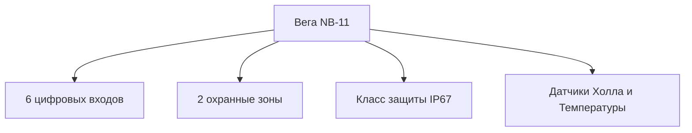
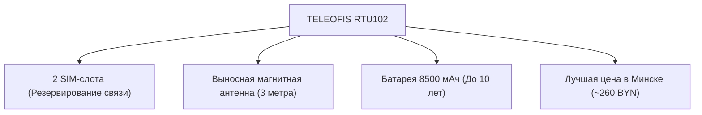

Автоматизация сбора показаний с приборов учета коммунальных ресурсов в Беларуси активно развивается. Согласно требованиям ресурсоснабжающих организаций (УП «Минскводоканал», Минские тепловые сети), современные узлы учета должны оснащаться системами дистанционной передачи данных. Наиболее перспективной и экономичной технологией для этих задач является **NB-IoT** (Narrowband IoT).

На белорусском рынке систем диспетчеризации сформировалась тройка лидеров среди радиомодемов (счетчиков импульсов), подключаемых к стандартным приборам учета: **Вега NB-11**, отечественный модуль **Юпитер 2576** (от Nero Electronics) и промышленный радиомодем **TELEOFIS RTU102**.

В этой статье мы проведем независимое техническое сравнение этих трех приборов, разберем их реальные сильные и слабые стороны и поможем председателям ТС, ЖСПК, главным инженерам и застройщикам сделать правильный выбор.

---

## Сводная таблица технических характеристик

| Характеристика / Параметр        | Модуль Вега NB-11                | Юпитер 2576 (Nero)              | TELEOFIS RTU102                  |
| :------------------------------- | :------------------------------- | :------------------------------ | :------------------------------- |
| **Количество импульсных входов** | **6 входов** (2 в режиме охраны) | 2 входа                         | **4 входа** (универсальные)      |
| **SIM-слоты (резервирование)**   | 1 SIM-слот (Nano-SIM)            | 1 SIM-слот (Nano-SIM)           | **2 SIM-слота** (МТС + А1)       |
| **Степень защиты корпуса**       | **IP67** (пылевлагозащищенный)   | **IP68** (полная герметичность) | IP65 (опционально IP68)          |
| **Срок автономной работы**       | до 3–5 лет (батарея 6400 мАч)    | до 5–7 лет (встроенная батарея) | **до 10 лет** (батарея 8500 мАч) |
| **Тип антенны**                  | Внешняя ( whip-антенна)          | Встроенная внутренняя           | Выносная на магните (3м кабель)  |
| **Дополнительные датчики**       | Температура, датчик Холла        | Датчик вскрытия                 | Датчик температуры (опция)       |
| **Разработка и производство**    | Вега-Абсолют (Россия)            | Nero Electronics (Беларусь)     | ТЕЛЕОФИС (Россия)                |
| **Розничная цена (ориентир)**    | **499 BYN**                      | ~245–270 BYN                    | **~260 BYN** (супер-выгода)      |

---

## 1. Вега NB-11: Многоканальный рекордсмен с функциями охраны

[**Вега NB-11**](/store/vega-nb11/) — это многофункциональный **счетчик импульсов NB-IoT**, выпускаемый российской компанией «Вега-Абсолют» и пользующийся заслуженной популярностью у интеграторов.

### Главные преимущества:

- **6 цифровых входов:** Абсолютный лидер по количеству каналов. К одному прибору можно одновременно подключить, например: 2 квартирных счетчика воды (ХВС + ГВС), теплосчетчик, газовый счетчик и датчики протечки/вскрытия.
- **Охранный функционал:** Два входа могут гибко настраиваться в качестве охранных шлейфов. Прибор моментально выходит на связь и отправляет тревожное оповещение при открытии шкафа, срабатывании пожарного извещателя или датчика протечки воды.
- **Класс защиты IP67:** Корпус полностью защищен от пыли и выдерживает временное затопление водой, что крайне критично для сырых подвалов и колодцев.
- **Интеграция с ПО «Мой Клиент: Ресурсы»:** Модуль сертифицирован и готов к автоматической передаче показаний в Минскводоканал.

### Недостатки:

- **Высокая стоимость:** Розничная цена составляет **499 BYN**, что делает его самым дорогим решением в тройке (однако цена компенсируется большим количеством каналов).
- **Срок службы батареи:** Из-за обилия опрашиваемых датчиков и более компактного элемента питания емкостью 6400 мАч реальный ресурс батареи при частой отправке редко превышает 3 года.

---

## 2. Юпитер 2576: Надежный белорусский боец для экстремальных условий

Радиомодем **Юпитер 2576** разработан совместным белорусско-германским предприятием ООО «Неро Электроникс». Это локализованное отечественное решение, созданное специально под требования белорусского ЖКХ.

### Главные преимущества:

- **Класс защиты IP68:** Полностью герметичный корпус. Прибор может работать, будучи полностью затопленным водой в глубоких колодцах в течение длительного времени.
- **Долговечность:** Встроенный аккумулятор 3.6 В обеспечивает до 5–7 лет автономной работы благодаря оптимизированному потреблению и внутреннему алгоритму консервации энергии.
- **Локальный продукт:** Отсутствие проблем с логистикой и оперативная техническая поддержка производителя в Минске.

### Недостатки:

- **Всего 2 импульсных входа:** Модуль может обслуживать только два прибора учета (например, ХВС и ГВС в рамках одной квартиры). Для сложных тепловых узлов или многоканального учета придется покупать несколько модемов.
- **Встроенная антенна:** Встроенная антенна Юпитера исключает возможность выноса приемопередатчика из экранирующих металлических ящиков или глубоких бетонных шахт. В зонах со слабым сигналом NB-IoT модем может терять сеть.
- **Один SIM-слот:** Отсутствие резервирования канала связи сотового оператора.

---

## 3. TELEOFIS RTU102 NB-IoT: Промышленный стандарт и лучшая цена

УСПД [**TELEOFIS RTU102 NB-IoT**](/store/rtu102-nb-iot/) — это мощный телеметрический контроллер, признанный золотым стандартом для организации диспетчеризации в Товариществах Собственников (ТС) и ЖСПК в Минске.

### Главные преимущества:

- **2 SIM-слота (Уникально!):** Единственный прибор в обзоре, поддерживающий резервирование связи на уровне операторов. Вы можете установить SIM-карты МТС и А1. При сбое сети одного оператора прибор автоматически переключится на второго, гарантируя 100% доставку данных инспекторам Водоканала.
- **Максимальная автономность:** Литиевая батарея рекордной емкости **8500 мАч** обеспечивает автономную работу до **10 лет** (при отправке данных 1 раз в сутки).
- **Выносная антенна на магните:** Идет в базовом комплекте. Трехметровый кабель позволяет установить прибор глубоко в подвале или металлическом щитке, а саму антенну вывести в зону уверенного приема NB-IoT.
- **Идеальная цена:** При стоимости около **260 BYN** и наличии **4 универсальных импульсных входов** этот модем является безусловным лидером по экономичности.

### Недостатки:

- Базовый корпус имеет класс защиты IP65 (для влажных подвалов и колодцев требуется монтаж в дополнительный герметичный бокс или заказ специальной герметизированной версии IP68).

---

## Что выбрать: Сравнительный анализ сценариев

Для того чтобы понять, какой **nb-iot модуль для счетчика воды** или тепла подойдет именно вам, мы подготовили практические рекомендации:

### Сценарий 1: Индивидуальный узел учета в квартире или офисе (ХВС + ГВС)

- **Решение:** **Юпитер 2576** или **TELEOFIS RTU102**.
- **Почему:** Оба устройства отлично справятся с 2 счетчиками воды. Юпитер привлекает полной влагозащитой, а TELEOFIS RTU102 — более доступной ценой и возможностью выноса антенны из сантехнического шкафа.

### Сценарий 2: Общедомовые узлы учета в ТС / ЖСПК и глубокие сырые подвалы

- **Решение:** **TELEOFIS RTU102** (с установкой в гермобокс).
- **Почему:** Резервирование связи через 2 SIM-карты критически важно для общедомового учета. Сбой связи в отчетный период грозит штрафами или расчетом по среднему тарифу. Две SIM-карты (МТС + А1) и выносная антенна на 3-метровом кабеле полностью исключают эту проблему.

### Сценарий 3: Сложные тепловые пункты и узлы учета (более 4 приборов + датчики безопасности)

- **Решение:** **Вега NB-11**.
- **Почему:** 6 входов позволяют подключить абсолютно все приборы в одном месте (например: 2 счетчика воды, теплосчетчик, датчик давления, датчик температуры и датчик вскрытия двери). Это дешевле и проще, чем устанавливать два отдельных 2- или 4-входовых модема.

---

## Заключение

Все три радиомодема внесены в Государственный реестр средств измерений Республики Беларусь и одобрены для автоматической передачи показаний в Водоканал.

- Если для вас в приоритете **максимальная надежность связи и рекордный срок службы батареи** при минимальной цене за канал — выбирайте [**TELEOFIS RTU102 NB-IoT**](/store/rtu102-nb-iot/).
- Если вам требуется **подключить большое количество приборов и настроить охранную сигнализацию** — лучшим решением станет [**Модуль Вега NB-11**](/store/vega-nb11/).
- Для **затапливаемых колодцев** и одиночных приборов без необходимости резервирования связи отлично подойдет отечественный **Юпитер 2576**.

Наша компания осуществляет продажу, проектирование и установку систем дистанционного съема показаний в Минске «под ключ». Мы поможем подготовить все необходимые документы для сдачи узла учета инспектору УП «Минскводоканал».

📞 **Для консультации и заказа оборудования звоните по телефону:** **[+375 29 8-462-462](tel:+375298462462)**
✉️ **Отправляйте технические задания на почту:** **info@teleofis24.by**
