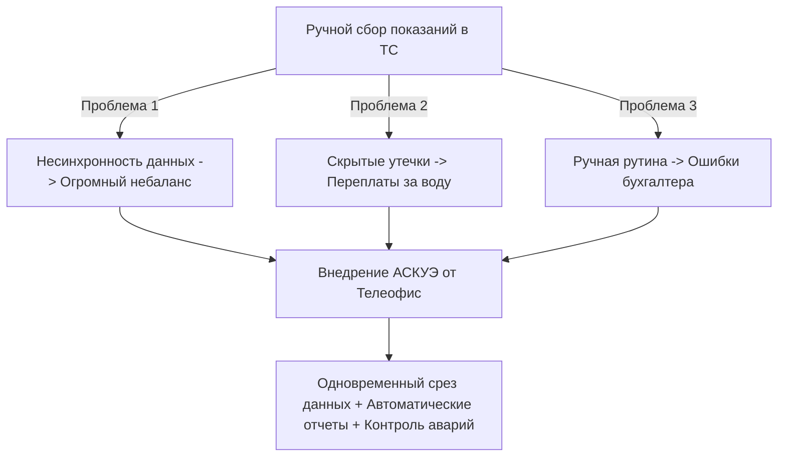

**Автоматизированная система дистанционного съема показаний (АСКУЭ воды)** для товариществ собственников (ТС) и ЖСПК — это единственное надежное инженерное решение, позволяющее полностью устранить коммерческий небаланс расхода воды, исключить ошибки ручного ввода и мгновенно выявлять скрытые утечки в жилом доме.

Компания «Телеофис» предлагает комплексные услуги по проектированию, поставке сертифицированного оборудования, монтажу и сдаче систем диспетчеризации «под ключ» в Минске и Минском районе.

---

## 3 главные проблемы ТС, которые решает дистанционный учет

Без автоматизации сбора показаний правление товарищества ежемесячно тратит время и ресурсы на решение типовых проблем:

1.  **Потери бюджета из-за небаланса:** Жильцы подают показания в разные дни. Разница между показаниями общедомового водомера и суммой квартирных счетчиков (небаланс) ложится на плечи ТС и гасится из общего фонда.
2.  **Скрытые утечки в квартирах:** Неисправная сантехника или постоянно подтекающие бачки унитазов в пустующих квартирах приводят к колоссальным потерям воды, которые обнаруживаются только при получении очередного счета от Водоканала.
3.  **Человеческий фактор:** Председатель или бухгалтер вынуждены тратить дни на сбор бумажных квитанций, обзвон жильцов, ручную сверку и заполнение таблиц для расчетно-справочного центра.

---

## Как устроена система диспетчеризации NB-IoT

Современное решение АСКУЭ строится на беспроводной технологии сотовой связи **NB-IoT (Narrowband Internet of Things)**. Оно не требует прокладки сотен метров кабелей по подъездам и штробления стен:

- **Квартирный узел:** Обычные счетчики воды оснащаются импульсными датчиками (герконами).
- **Сбор и передача данных:** Импульсные выходы подключаются к автономным радиомодемам **Teleofis RTU102**. Устройство накапливает импульсы и раз в сутки передает пакет данных через сеть сотового оператора (МТС или А1) на диспетчерский сервер.
- **Личный кабинет председателя:** Вся информация поступает в облачную платформу **«Мой Клиент: Ресурсы»**. Председатель и бухгалтер видят детальные отчеты по расходу каждой квартиры, графики потребления и мгновенно получают тревожные уведомления о протечках или воздействии магнитом на счетчики.

---

## Стоимость внедрения АСКУЭ для ТС и ЖСПК

Мы предлагаем гибкие сметные решения и оптовые цены на оборудование для многоквартирных домов:

| Оборудование / Услуга             | Описание и состав комплекта                                                                                                  | Цена (BYN)                |
| :-------------------------------- | :--------------------------------------------------------------------------------------------------------------------------- | :------------------------ |
| **NB-IoT модуль Teleofis RTU102** | 4 импульсных входа, 2 слота для SIM-карт (резервирование МТС + А1), выносная антенна на магните, батарея на 10 лет.          | **от 260 руб.**           |
| **Комплект для квартиры**         | 2 счетчика воды Ду-15 с импульсным выходом + доля в стоимости NB-IoT модуля.                                                 | **от 329 руб.**           |
| **Установка системы «Под Ключ»**  | Разработка схемы, монтаж модулей связи в сантехнических нишах, пусконаладка, подключение к платформе, подготовка документов. | **Индивидуальный расчет** |

> [!TIP]
> **Хотите получить точный расчет стоимости АСКУЭ для вашего ТС?**
> Свяжитесь с нашими инженерами по телефону **[+375 29 8-462-462](tel:+375298462462)** или отправьте технические характеристики вашего дома в Telegram **[@teleofis24](https://t.me/teleofis24)** — подготовим смету в течение 1 рабочего дня с учетом оптовых скидок!

---

## Выполнение требований Постановления № 788

Внедрение дистанционного съема — это не только удобство, но и обязанность ТС. Согласно **Постановлению Совета Министров Республики Беларусь № 788**, все приборы коммерческого учета после ремонта или очередной поверки обязаны сдаваться УП «Минскводоканал» с подключенной системой дистанционного съема показаний.

Мы берем на себя полное документальное сопровождение:

1. Составление схемы подключений и исполнительной документации.
2. Оформление акта ввода системы СДСП в эксплуатацию.
3. Сопровождение визита инспектора Минскводоканала для опломбировки приборов и приемки узла учета на коммерческий баланс.

Освободите товарищество от рутины ручного сбора показаний и небалансов. Закажите профессиональный расчет АСКУЭ в компании «Телеофис»!

👉 [**Перейти в контакты для отправки заявки**](/contact/) или позвонить по телефону **[+375 29 8-462-462](tel:+375298462462)**.
