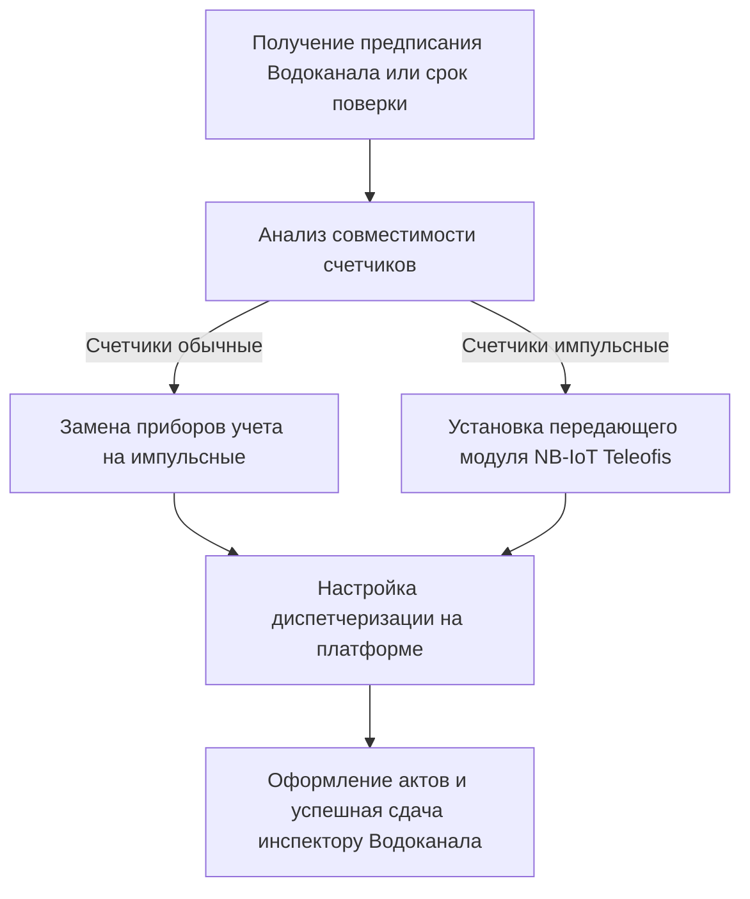

**Система дистанционного съема показаний счетчиков воды (СДСП)** для юридических лиц, предприятий и коммерческих организаций — это обязательное требование законодательства Республики Беларусь и единственный способ обеспечить точный учет энергоресурсов, исключив переплаты за водоснабжение по повышенным тарифам и штрафным нормативам.

Компания «Телеофис» осуществляет подбор сертифицированного оборудования, комплексный монтаж, программирование и сдачу коммерческих узлов учета воды инспекторам УП «Минскводоканал» «под ключ».

---

## Законодательная основа: Постановление Совета Министров РБ № 788

В Республике Беларусь действуют строгие нормативы в отношении автоматизации контроля расхода воды для бизнеса:

> Согласно Постановлению Совета Министров РБ № 788, все вновь устанавливаемые, заменяемые или прошедшие государственную поверку приборы учета воды юридических лиц и индивидуальных предпринимателей **в обязательном порядке должны быть интегрированы в систему дистанционного съема**.

Если ваше предприятие получило предписание от Водоканала или подходит срок плановой поверки ваших водомеров — просто поверить прибор и поставить его обратно нельзя. Его необходимо дооснастить передающим модулем связи и сдать инспектору по акту ввода СДСП.

---

## Финансовые риски: почему откладывать установку СДСП опасно

Для юридических лиц последствия работы без коммерческого учета воды крайне жесткие:

- **Расчет по сечению трубы:** Согласно Правилам пользования коммунальными системами водоснабжения, при отсутствии принятого коммерческого узла учета, Водоканал производит расчет потребления воды по пропускной способности трубы (при скорости 2 м/с 24 часа в сутки).
- **Случай из практики:** Для небольшой трубы диаметром 25 мм такой расчет приводит к начислению платы за **сотни кубических метров воды в сутки**, что выливается в счета на несколько тысяч рублей в месяц даже при нулевом реальном расходе.
- **Затраты на внедрение окупаются мгновенно:** Стоимость установки автономного NB-IoT модуля под ключ несопоставима с рисками получения огромных счетов от ресурсоснабжающей организации.

---

## Сколько стоит организация дистанционного учета для бизнеса

Мы предлагаем прозрачные условия работы, безналичный расчет со всеми закрывающими документами и официальную гарантию на оборудование и работы:

| Состав решения / оборудования     | Что входит в стоимость                                                                                                                                    | Цена (BYN)        |
| :-------------------------------- | :-------------------------------------------------------------------------------------------------------------------------------------------------------- | :---------------- |
| **NB-IoT модуль Teleofis RTU102** | Промышленный радиомодем, выносная магнитная антенна, встроенная батарея до 10 лет работы, SIM-карта МТС с тарифом для IoT. Самый дешевый в Минске модуль. | **260 руб.**      |
| **Импульсный счетчик Ду-15/20**   | Счетчик воды Декаст с импульсным датчиком геркона (10 л/имп), внесенный в Госреестр СИ РБ.                                                                | **от 87 руб.**    |
| **Установка системы «Под Ключ»**  | Доставка, монтаж контроллера, подключение импульсных кабелей, пусконаладка, запуск передачи данных, пакет актов ввода СДСП.                               | **514 руб.**      |
| **Замена водомеров с монтажом**   | Демонтаж старых приборов, монтаж новых импульсных водомеров, пломбировка соединений, выдача актов.                                                        | **Индивидуально** |

> [!IMPORTANT]
> **Требуется коммерческое предложение для вашей организации?**
> Свяжитесь с нами по телефону **[+375 29 8-462-462](tel:+375298462462)** или отправьте фото вашего узла учета и реквизиты на электронную почту **info@teleofis24.by** (или в Telegram **[@teleofis24](https://t.me/teleofis24)**) — подготовим КП и договор в течение 15 минут!

---

## Преимущества работы с компанией «Телеофис»

1.  **Официальный партнер:** Поставляем только сертифицированное оборудование TELEOFIS, внесенное в Государственный реестр средств измерений Республики Беларусь (Сертификат № 87749-22).
2.  **Сдача Водоканалу с первой попытки:** Мы досконально знаем технические требования и стандарты УП «Минскводоканал» и гарантируем успешную приемку узла.
3.  **Полная автономность:** Используем мощные литиевые элементы питания (Li-SOCl2), благодаря чему передающие модули работают до 10 лет без подключения сети 220 В.
4.  **Безналичный расчет:** Работаем с юридическими лицами любой формы собственности с предоставлением актов выполненных работ и закрывающих документов.

Обеспечьте точный и прозрачный учет ресурсов вашего бизнеса без штрафов и рисков. Доверьте установку системы дистанционного съема профессионалам компании «Телеофис»!

👉 [**Перейти на страницу контактов для обратной связи**](/contact/) или позвонить по телефону **[+375 29 8-462-462](tel:+375298462462)**.
