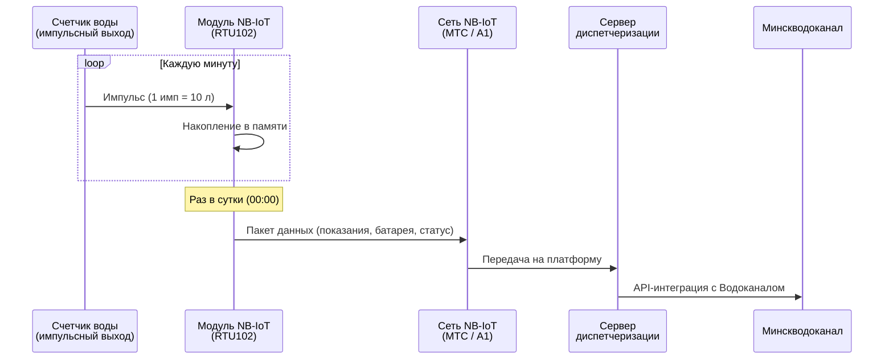

**Модуль NB-IoT для счетчика воды** — это автономное устройство передачи данных, которое подключается к водомеру с импульсным выходом и автоматически отправляет показания через специализированную сеть телеметрии NB-IoT. Решение полностью исключает человеческий фактор при сборе показаний и обеспечивает соответствие требованиям УП «Минскводоканал» о дистанционном съеме.

На этой странице вы найдете информацию о доступных моделях модулей NB-IoT, их характеристиках, схемах подключения и вариантах приобретения с доставкой по Минску и Беларуси.

---

## Модели модулей NB-IoT для счетчиков воды

### TELEOFIS RTU102 NB-IoT

Флагманский модуль NB-IoT, обеспечивающий максимальную надежность передачи данных в любых условиях эксплуатации.

| Характеристика | Значение |
| :------------- | :------- |
| **Каналов учета** | 4 импульсных входа (вода, тепло, газ) |
| **SIM-карт** | 2 (резервирование МТС + А1) |
| **Антенна** | Выносная, на магнитном основании |
| **Батарея** | Li-SOCl₂ 8500 мАч, до 10 лет работы |
| **Стандарт связи** | NB-IoT Cat NB2 (Quectel BC95-G) |
| **Защита** | IP65 (герметизация до IP68) |
| **Протоколы** | TCP, UDP, MQTT, CoAP |
| **Сертификация** | Госреестр СИ РБ № 87749-22 |
| **Цена** | **{{price:rtu102-nb-iot}} BYN** |

[Купить TELEOFIS RTU102](/store/rtu102-nb-iot/)

### Вега NB-11

Бюджетный модуль NB-IoT для подключения 1–2 счетчиков воды. Компактный корпус IP67, встроенная антенна, автономность до 7 лет. Подходит для квартир и небольших узлов учета.

| Характеристика | Значение |
| :------------- | :------- |
| Каналов учета | 2 |
| SIM-слотов | 1 |
| Антенна | Встроенная |
| Автономность | до 7 лет |
| Цена | **{{price:vega-nb11}} BYN** |

[Купить Вега NB-11](/store/vega-nb11/)

### Zeta NB (Тахат)

Белорусский модуль NB-IoT, часто применяемый в новостройках. Доступен в версиях на 2 или 4 импульсных входа.

| Характеристика | Значение |
| :------------- | :------- |
| Каналов учета | 2 или 4 |
| SIM-слотов | 1 |
| Антенна | Встроенная (выносная — опция) |
| Автономность | до 5–6 лет |
| Цена | от ~280 BYN |

---

## Как работает модуль NB-IoT со счетчиком воды

Принцип работы:

1. Счетчик воды с импульсным выходом формирует электрический импульс при прохождении каждого заданного объема воды (например, 10 литров).
2. Модуль NB-IoT круглосуточно подсчитывает импульсы и сохраняет накопленное значение в энергонезависимой памяти.
3. По расписанию (обычно раз в сутки, ночью) модуль активирует радиомодуль, соединяется с сетью NB-IoT и отправляет пакет данных на сервер.
4. Данные становятся доступны в личном кабинете платформы «Мой Клиент: Ресурсы» и автоматически передаются в Минскводоканал.

---

## Сравнение модулей NB-IoT для счетчиков воды

| Критерий | TELEOFIS RTU102 | Вега NB-11 | Zeta NB |
| :------- | :-------------: | :--------: | :-----: |
| **Количество водомеров** | до 4 | до 2 | до 2 (или 4) |
| **Резервирование связи** | Да (2 SIM) | Нет | Нет |
| **Антенна** | Выносная (в компл.) | Встроенная | Встроенная |
| **Срок батареи** | **до 10 лет** | до 7 лет | до 5–6 лет |
| **Защита корпуса** | **IP65 / IP68** | IP67 | IP65 |
| **MQTT** | Да | Нет | Нет |
| **Цена** | **{{price:rtu102-nb-iot}} BYN** | {{price:vega-nb11}} BYN | ~280 BYN |
| **Рекомендация** | Лучший выбор | Бюджетный вариант | Для проектов |

### Почему TELEOFIS RTU102 — лучший модуль NB-IoT для счетчика воды:

- **Резервирование SIM-карт** — единственный модуль с двумя слотами. Если «упала» сеть МТС, автоматически переключается на А1.
- **4 универсальных входа** — подключите холодную, горячую воду и теплосчетчик к одному устройству.
- **Выносная антенна** — выведите её из подвала и забудьте о проблемах с сигналом.
- **Батарея на 10 лет** — не нужно менять элемент питания в течение всего срока службы счетчиков.
- **MQTT** — современный протокол для интеграции с любой SCADA-системой.

---

## Варианты комплектации и цены

Вы можете приобрести модуль NB-IoT для счетчика воды отдельно или в составе готового комплекта:

| Комплектация | Для кого | Состав | Цена |
| :----------- | :------- | :----- | :--: |
| **Только модуль** | Системные интеграторы, опытные пользователи | RTU102 + антенна, без SIM и настройки | **{{price:rtu102-nb-iot}} BYN** |
| **Модуль + SIM + программа** | ТС, ЖСПК, юрлица — готовое решение | RTU102 + SIM МТС + ПО на 1 год + настройка | **{{price:modul-sim-programm}} BYN** |
| **Комплект с водомерами** | Новые объекты, замена старых счетчиков | Модуль + SIM + ПО + 2 счетчика 15 мм | **{{price:komplekt-nbiot-2-schetchika-vody-15-mm}} BYN** |
| **Комплект с водомером Ду 20** | Объекты с повышенным расходом | Модуль + SIM + ПО + счетчик 20 мм | **{{price:komplekt-nbiot-schetchik-vody-du-20-mm}} BYN** |

[Перейти в каталог оборудования](/store/)

---

## Подключение модуля NB-IoT к счетчику воды

### Что нужно для подключения:

1. **Счетчик воды с импульсным выходом** — наличие сигнального кабеля (2 жилы), выходящего из корпуса водомера.
2. **Модуль NB-IoT** — TELEOFIS RTU102 или аналог.
3. **SIM-карта с поддержкой NB-IoT** — специальный тариф МТС или А1 для телеметрии.
4. **Доступ к месту установки** — возможность закрепить модуль и вывести антенну.

### Порядок подключения:

1. **Закрепите модуль** на DIN-рейке, стене или на корпусе щитка.
2. **Подключите сигнальный кабель** от импульсного выхода счетчика к клеммной колодке модуля (Вход 1 для ХВС, Вход 2 для ГВС).
3. **Установите SIM-карту** в слот. Для RTU102 можно установить две карты — основную и резервную.
4. **Выведите антенну** из металлического щитка наружу. Закрепите магнитное основание на любой стальной поверхности.
5. **Проверьте индикацию** — светодиод на плате модуля сообщит о регистрации в сети NB-IoT.

> [!IMPORTANT]
> **Требуется профессиональная установка?** Закажите [услугу монтажа и настройки модуля NB-IoT](/store/ustanovka-i-nastrojka-nb-iot-modulya/). Мастер выполнит все работы за 1–2 часа и выдаст акт ввода системы дистанционного съема (СДСП) — обязательный документ для приемки инспектором Водоканала.

---

## На какие счетчики воды устанавливается модуль NB-IoT

Модуль NB-IoT совместим со всеми типами водомеров, имеющих импульсный выход. Ниже — подтвержденная совместимость с популярными брендами:

### Крыльчатые счетчики (Ду 15–40 мм):

- **Zenner** (Германия)
- **Sensus** (Германия)
- **Белценнер** (Беларусь)
- **Декаст ВСКМ** (Беларусь)
- **Itron** (Франция)
- **Maddalena** (Италия)

### Турбинные и промышленные счетчики (Ду 50–150 мм):

- **WPH-N / Вольтман** — требуется установка [датчика импульсов](/store/datchik-impulsov-dlya-schetchika-voltmana-tipa-w/)
- **Apator Powogaz** (Польша)

### Теплосчетчики:

- **ТЭМ-104** (Беларусь)
- **Multical** (Дания)

---

## Как заказать модуль NB-IoT для счетчика воды

### Быстрый заказ:

1. **Выберите комплектацию** в таблице выше или позвоните нам для консультации.
2. **Оформите заказ** через корзину на сайте или по телефону.
3. **Получите оборудование** — самовывоз в Минске или доставка по Беларуси.
4. **Установите самостоятельно** или закажите монтаж «под ключ».

### Контакты:

- **Телефон:** [+375 (29) 8-462-462](tel:+375298462462)
- **Telegram:** [@teleofis24](https://t.me/teleofis24)
- **Email:** info@teleofis24.by

### Способы оплаты:

- Безналичный расчет для юридических лиц (с НДС)
- Оплата через ЕРИП
- Наличный расчет при самовывозе
- Онлайн-оплата картой

---

## Доставка

| Регион | Способ | Срок |
| :----- | :----- | :--- |
| Минск | Курьер / самовывоз | День в день |
| Минская область | Курьер | 1–2 дня |
| Областные центры | Белпочта / курьер | 2–4 дня |
| Районные центры | Белпочта | 3–5 дней |

Бесплатная доставка по Минску при заказе от 300 BYN.

---

## Дополнительные услуги

Мы не просто продаем оборудование — мы обеспечиваем полный цикл внедрения системы дистанционного учета воды:

- **[Установка и настройка модуля NB-IoT](/store/ustanovka-i-nastrojka-nb-iot-modulya/)** — монтаж, программирование, акт ввода СДСП
- **[Услуги сантехника — замена счетчиков воды](/uslugi-santehnika-zamena-schetchika-vodi/)** — демонтаж старых и монтаж новых импульсных водомеров
- **[Ремонт и обслуживание модулей Zeta Тахат](/remont-obsluzhivanie-zeta-tahat/)** — замена батарей, перепрошивка, восстановление связи
- **[Подключение ТЭМ-104 к Минскводоканалу](/podklyuchenie-tem-104-lte-minskvodokanal/)** — интеграция теплосчетчиков в систему диспетчеризации

---

## Сертификация и документация

Все поставляемое оборудование имеет необходимые сертификаты для применения на территории Республики Беларусь:

- **Сертификат об утверждении типа средств измерений № 87749-22** (Госстандарт РБ)
- Паспорт прибора
- Инструкция по эксплуатации
- Гарантийный талон (1 год)

При заказе монтажа «под ключ» вы также получаете:
- Акт ввода системы дистанционного съема показаний (СДСП)
- Акт выполненных работ
- Схему подключения
