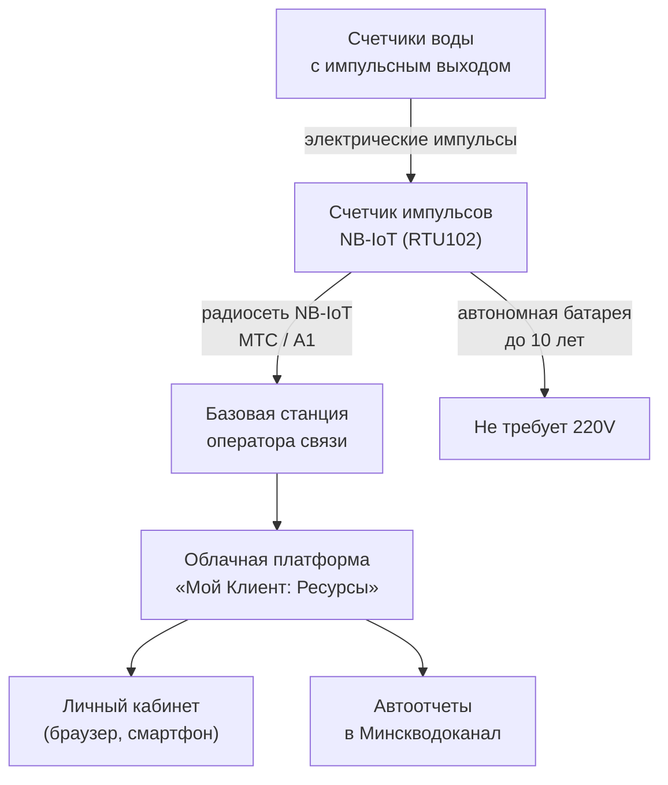

**Счетчик импульсов NB-IoT** — это автономное устройство сбора и передачи данных, предназначенное для автоматического дистанционного снятия показаний с приборов учета воды, тепла и газа. В отличие от обычного импульсного счетчика, устройство не измеряет расход ресурса — оно **подключается к существующим водомерам** и оцифровывает их показания.

Если вам необходимо оперативно купить счетчик импульсов NB-IoT в Минске для исполнения предписания Водоканала или автоматизации учета на предприятии — вы находитесь по адресу. Ниже представлена вся информация о доступном оборудовании, его характеристиках и вариантах приобретения.

---

## Доступные модели счетчиков импульсов NB-IoT

### TELEOFIS RTU102 NB-IoT — флагманская модель

Самый функциональный счетчик импульсов NB-IoT на рынке Беларуси. Обеспечивает максимальную надежность передачи данных благодаря резервированию каналов связи.

| Характеристика | Значение |
| :------------- | :------- |
| **Импульсных входов** | 4 универсальных (подключение до 4 счетчиков) |
| **SIM-слотов** | 2 (одновременная работа МТС + А1) |
| **Антенна** | Выносная на магнитном основании (в комплекте) |
| **Автономность** | До 10 лет от встроенной батареи 8500 мАч |
| **Защита корпуса** | IP65 (возможно исполнение IP68) |
| **Протоколы** | TCP, UDP, MQTT, CoAP |
| **Сертификат СИ РБ** | № 87749-22 |
| **Гарантия** | 1 год |
| **Цена** | **{{price:rtu102-nb-iot}} BYN** |

[Купить TELEOFIS RTU102](/store/rtu102-nb-iot/)

### Другие модели в наличии

| Модель | Входов | SIM | Автономность | Цена |
| :----- | :----: | :-: | :----------: | :--: |
| **Вега NB-11** | 2 | 1 | до 7 лет | **{{price:vega-nb11}} BYN** |
| **Zeta NB (Тахат)** | 2 или 4 | 1 | до 5–6 лет | от ~280 BYN |

---

## Как работает счетчик импульсов NB-IoT

Принцип работы прост и надежен: модуль подключается к импульсным выходам водомеров и каждую минуту фиксирует поступающие электрические сигналы. Раз в сутки (время настраивается) накопленные показания отправляются на сервер диспетчеризации через сеть NB-IoT.

---

## Преимущества использования счетчика импульсов NB-IoT

### 1. Полная автоматизация учета
Забудьте про ежемесячные обходы подвалов и ручное списывание цифр с циферблатов. Показания передаются автоматически по расписанию — без участия человека.

### 2. Исполнение требований Водоканала
Согласно Постановлению №788, все вновь устанавливаемые и заменяемые приборы учета должны быть оснащены системой дистанционного съема показаний (СДСП). Модуль NB-IoT полностью удовлетворяет этому требованию.

### 3. Экономия на количестве устройств
Один модуль обслуживает до 4 счетчиков — не нужно покупать отдельный передатчик на каждый водомер. В масштабах ТС или предприятия экономия существенная.

### 4. Автономная работа без розетки
Встроенная литиевая батарея обеспечивает до 10 лет непрерывной работы. Не нужно тянуть кабель 220 В в подвал и согласовывать электроточку.

### 5. Резервирование каналов связи
Модель RTU102 имеет два SIM-слота. При пропадании сети одного оператора автоматически переключается на второго. Критически важно для коммерческого учета.

---

## Варианты комплектации и цены

В нашем магазине вы можете приобрести счетчик импульсов NB-IoT в нескольких вариантах:

| Комплектация | Состав | Цена | Ссылка |
| :----------- | :----- | :--: | :----- |
| **Только оборудование** | RTU102 + антенна (без SIM и настройки) | **{{price:rtu102-nb-iot}} BYN** | [Купить](/store/rtu102-nb-iot/) |
| **Модуль + SIM + программа** | RTU102 + SIM МТС + ПО на 1 год | **{{price:modul-sim-programm}} BYN** | [Купить](/store/modul-sim-programm/) |
| **Комплект с 2 счетчиками** | RTU102 + SIM + ПО + 2 водомера 15 мм | **{{price:komplekt-nbiot-2-schetchika-vody-15-mm}} BYN** | [Купить](/store/komplekt-nbiot-2-schetchika-vody-15-mm/) |
| **Установка «под ключ»** | Выезд мастера + монтаж + настройка + акты | **{{price:modul-sim-programm}} BYN** | [Купить](/store/modul-sim-programm/) |

---

## Схема подключения и монтажа

Установка счетчика импульсов NB-IoT выполняется за 30–60 минут и не требует специального инструмента:

1. **Закрепите модуль** на DIN-рейку или стену рядом со счетчиками.
2. **Подключите кабели** от импульсных выходов водомеров к клеммам «Вход 1» – «Вход 4» (полярность не важна — геркон это сухой контакт).
3. **Установите SIM-карту** (и вторую для резервирования).
4. **Выведите антенну** за пределы металлического щитка и закрепите на магните.
5. **Проверьте индикацию** — светодиод на корпусе покажет статус регистрации в сети NB-IoT.

> [!TIP]
> **Не хотите заниматься монтажом самостоятельно?** Закажите [услугу установки и настройки NB-IoT модуля](/store/ustanovka-i-nastrojka-nb-iot-modulya/). Наш специалист выполнит все работы и выдаст полный пакет документов для приемки узла учета Водоканалом.

---

## Совместимость со счетчиками воды и тепла

Счетчик импульсов NB-IoT совместим с любыми приборами учета, оснащенными:

- **Герконовым датчиком (сухой контакт)** — наиболее распространенный тип, используется в 95% квартирных и общедомовых водомеров.
- **Выходом NAMUR** — промышленный стандарт с контролем обрыва линии.
- **Оптопарой (открытый коллектор)** — в ультразвуковых и электромагнитных расходомерах.

Если ваши счетчики не имеют импульсного выхода, мы предлагаем:

- [Замену на водомеры с импульсным выходом Ду 15 мм](/store/schetchik-vody-15-mm-s-impulsnym-vyhodom/) — **от {{price:schetchik-vody-15-mm-s-impulsnym-vyhodom}} BYN**
- [Установку накладного датчика импульсов на турбинные счетчики](/store/datchik-impulsov-dlya-schetchika-voltmana-tipa-w/)
- [Услугу оснащения существующего счетчика импульсным выходом](/store/usluga-osnashchenie-schetchika-wph-impulsnym-vyhodom/)

---

## Как заказать счетчик импульсов NB-IoT

### Онлайн-заказ на сайте
Выберите нужную комплектацию в [каталоге оборудования](/store/) и оформите заказ через корзину.

### По телефону
Позвоните **[+375 (29) 8-462-462](tel:+375298462462)** — проконсультируем по наличию, характеристикам и поможем с выбором.

### Через Telegram
Отправьте фото вашего узла учета в Telegram **[@teleofis24](https://t.me/teleofis24)** — подберем оптимальный счетчик импульсов NB-IoT под ваш объект в течение 15 минут.

### Способы оплаты
- Наличный расчет (при самовывозе или доставке курьером)
- Безналичный расчет для юрлиц (с НДС, договор поставки)
- Оплата через ЕРИП (для физических лиц и ТС)
- Онлайн-оплата картой

---

## Доставка

- **Минск** — доставка день в день при заказе до 14:00. Бесплатно при сумме заказа от 300 BYN.
- **Минская область** — на следующий рабочий день.
- **Регионы Беларуси** — почтой (Белпочта, 2–4 дня) или курьерской службой.
- **Самовывоз** — Минск, склад в районе ст. м. Институт культуры.

---

## Документы и сертификаты

Все поставляемое оборудование сертифицировано для применения на территории Республики Беларусь:

- **Сертификат об утверждении типа средств измерений № 87749-22** (выдан Госстандартом РБ)
- Паспорт прибора с отметкой ОТК
- Инструкция по монтажу и эксплуатации
- Гарантийный талон на 1 год

С этим комплектом документов вы гарантированно пройдете приемку узла учета инспектором УП «Минскводоканал».

---

## Дополнительные услуги

Помимо продажи оборудования, мы предлагаем полный цикл услуг по внедрению системы дистанционного учета:

- **[Монтаж и настройка NB-IoT модуля](/store/ustanovka-i-nastrojka-nb-iot-modulya/)** — от {{price:ustanovka-i-nastrojka-nb-iot-modulya}} BYN
- **[Установка системы дистанционного съема «под ключ»](/uslugi-santehnika-zamena-schetchika-vodi/)** — полный цикл от проекта до сдачи
- **[Ремонт и обслуживание модулей Zeta Тахат](/remont-obsluzhivanie-zeta-tahat/)** — замена батарей, перепрошивка, перенастройка
