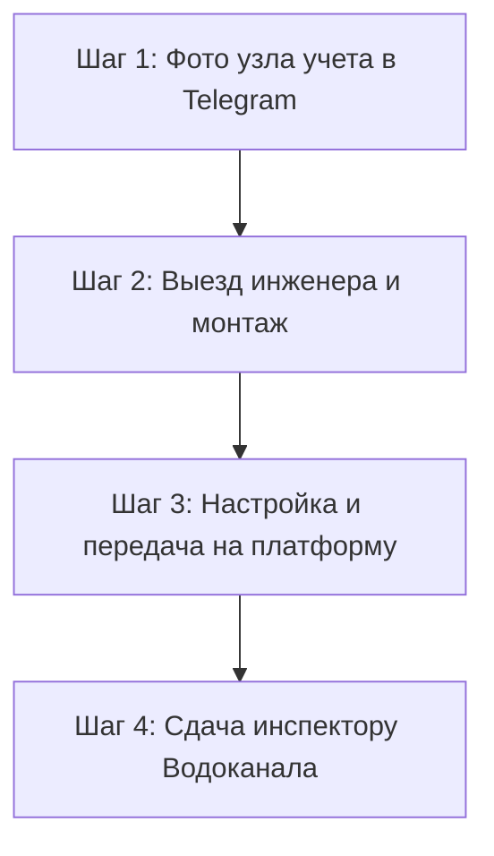

**Система дистанционного съема показаний (СДСП)** счетчиков воды и тепла — это современный и надежный инструмент для автоматизации учета потребления ресурсов, контроля небалансов и удаленного сбора данных. Наша компания предлагает профессиональное проектирование, монтаж и пусконаладку оборудования в Минске и Минском районе.

Мы поможем быстро и в соответствии со всеми стандартами установить и настроить систему дистанционного съема, подготовить полный пакет документов для инспектора УП «Минскводоканал» и гарантированно сдать узел коммерческого учета в эксплуатацию с первой попытки.

Работаем с товариществами собственников (ТС), ЖСПК, управляющими компаниями, государственными учреждениями и коммерческими предприятиями.

---

## Стоимость оборудования и работ «под ключ»

Мы предлагаем прозрачное ценообразование и готовые сметы под ваши задачи. Никаких скрытых наценок.

| Наименование комплекта / услуги                                            | Что входит в стоимость                                                                                                                                 | Цена (BYN)                                                        |
| :------------------------------------------------------------------------- | :----------------------------------------------------------------------------------------------------------------------------------------------------- | :---------------------------------------------------------------- |
| **NB-IoT модуль Teleofis RTU102** _(только оборудование)_                  | Модем с выносной магнитной антенной, встроенная батарея 3.6 В (до 10 лет работы), SIM-карта МТС со специальным тарифом. Самый дешевый в Минске модуль. | **{{price:rtu102-nb-iot}} руб.**                                  |
| **Установка системы «Под Ключ»** _(для существующих импульсных счетчиков)_ | Доставка оборудования, монтаж, пусконаладка, программирование, выдача пакета документов (акт ввода СДСП, акт выполненных работ).                       | **{{price:modul-sim-programm}} руб.**                             |
| **Комплект с заменой водомеров** _(модуль + 2 счетчика воды 15 мм)_        | NB-IoT модуль Teleofis, 2 счетчика воды Ду-15 мм с импульсным выходом, монтаж, пломбировка соединений, подготовка актов.                               | **{{price:komplekt-nbiot-2-schetchika-vody-15-mm}} руб.**         |
| **Ремонт и обслуживание Zeta Тахат**                                       | Замена элемента питания Li-SOCl2 3.6 В, восстановление прошивки, перенастройка IP-адресов серверов диспетчеризации.                                    | **{{price:usluga-remont-obsluzhivanie-modulya-zeta-tahat}} руб.** |

> [!TIP]
> **Хотите получить индивидуальную смету для вашей организации?**
> Свяжитесь с нами по телефону **[+375 29 8-462-462](tel:+375298462462)** или отправьте фото вашего узла учета в Telegram **[@teleofis24](https://t.me/teleofis24)** — подготовим точное коммерческое предложение в течение 15 минут!

---

## Схема работы по установке дистанционного съема

Внедрение системы автоматического сбора показаний проходит в 4 простых шага без лишней бюрократии:

1. **Консультация и подбор оборудования.** Вы присылаете фото ваших водомеров. Мы проверяем их на совместимость (наличие импульсных датчиков геркона). Если счетчики обычные — планируем их замену на импульсные.
2. **Монтажные работы.** Наш сертифицированный мастер выезжает на объект, надежно монтирует NB-IoT контроллер, подключает импульсные выходы приборов учета и выводит магнитную антенну в зону лучшего приема сотовой связи.
3. **Пусконаладка и подключение к ПО.** Программируем расписание передачи показаний (например, раз в сутки). Настраиваем передачу данных на платформу учета **«Мой Клиент: Ресурсы»** или диспетчерский сервер Водоканала. Проверяем прохождение контрольных пакетов.
4. **Сдача объекта.** Подготавливаем и передаем вам полный комплект документов для коммерческой приемки узла учета: акта ввода системы дистанционного съема в эксплуатацию, паспорта оборудования, сертификаты соответствия.

---

## Какое оборудование мы используем

Мы являемся официальным партнером и дилером ведущих производителей оборудования АСКУЭ. Для систем дистанционного сбора мы используем только поверенное и сертифицированное оборудование, отлично зарекомендовавшее себя в условиях белорусских подвалов:

- **Модемы и УСПД TELEOFIS RTU102 NB-IoT:** Обладают двумя SIM-слотами для резервирования каналов связи (А1 и МТС), степенью защиты IP65 (возможно герметичное исполнение IP68 для сырых колодцев) и выносной антенной на магните, что позволяет пробивать связь через толстые железобетонные перекрытия.
- **Импульсные счетчики воды Декаст, SmartFlow и др.:** Проверенные приборы с межповерочным интервалом 6 лет, высокой чувствительностью к малым расходам воды и встроенным антимагнитным экраном.

---

## Преимущества работы с компанией «Телеофис»

- **Официальный статус:** Все поставляемые приборы внесены в Государственный реестр средств измерений Республики Беларусь (Сертификат типа № 87749-22).
- **Сдача Водоканалу с первой попытки:** Мы досконально знаем актуальные технические требования УП «Минскводоканал» и гарантируем успешную пломбировку и ввод узла учета в коммерческую эксплуатацию.
- **Автономность систем:** Применяем мощные литиевые элементы питания. Ваша система сбора показаний работает полностью автономно от сети 220 В.
- **Удобные способы оплаты:** Работаем как по безналичному расчету с юридическими лицами (с предоставлением всех закрывающих документов), так и через платежную систему E-POS (ЕРИП) для физлиц и ТС.

---

## Ответы на частые вопросы (FAQ)

  
Обязательно ли устанавливать дистанционный съем?

  

    Да, согласно действующему законодательству (Постановление Совета Министров РБ №788), приборы учета после ремонта, плановой поверки или замены обязаны оснащаться системами дистанционного съема показаний. Без этого инспекторы УП «Минскводоканал» просто не примут узел на коммерческий баланс, и расчеты будут производиться по повышенным нормативам.
  

  
Будет ли работать связь в глубоком сыром подвале?

  

    Специализированный стандарт связи NB-IoT (Narrowband IoT) имеет повышенную проникающую способность радиосигнала, существенно превосходящую обычный стандарт GSM. Дополнительно наши специалисты комплектуют модули выносной магнитной антенной с коаксиальным кабелем, которую можно поднять выше уровня земли или вывести из металлического щита для обеспечения стабильной диспетчеризации.
  

  
Можем ли мы модернизировать уже установленные счетчики?

  

    Да. Если у вас стоят приборы учета с импульсным выходом (герконом), менять сами приборы нет никакой необходимости. Мы установим беспроводной NB-IoT модем и подключим его к вашим счетчикам, что сэкономит до 60% бюджета по сравнению с полной заменой узла учета.
  

---

## Заказать установку счетчиков с дистанционным съемом

Не откладывайте выполнение предписаний контролирующих органов до последнего дня. Обеспечьте точный и прозрачный учет воды в вашей организации уже сегодня.

👉 [**Заказать бесплатный расчет сметы**](/contact/) или позвонить по телефону **[+375 29 8-462-462](tel:+375298462462)**.
